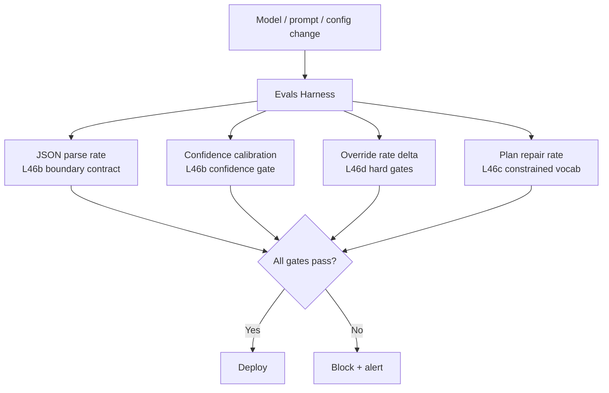

# L49: Evals Harness — Automated Testing for LLM Judgment Layers

**Code:** `12_orchestration/evals_harness.py`
**Reflection:** [`level-49-reflection.md`](../../.claude/learnings/reflections/level-49-reflection.md)

### Level 49: Evals Harness — Automated Testing for LLM Judgment Layers
**Goal:** Build an automated test harness that detects regression in the LLM judgment layer — so a model update, prompt change, or config drift doesn't silently degrade production behaviour

**Depends on:** L46 (Hybrid patterns — you need a judgment layer before you can test it), L35 (Evals SDK — Strands-specific evals)
**Unlocks:** Confident iteration on any level; production deployment gates

**The gap L35 doesn't fill:**
L35 (Strands Evals SDK) tests agent output quality. L49 tests the *boundary contracts* in a hybrid system: does the LLM still return parseable JSON? Does confidence calibration hold? Does the override rate drift? Does plan repair still cover the LLM's output distribution?

**Fowler on automated testing for LLM applications** (engineering-practices-llm.html):
*"You should decouple inference and testing, so that you can run inference, which is time-consuming even when done via LLM services, once and run multiple property-based tests on the results."* — Run inference once per test case, cache output, apply all test types to the cached result. Every additional test type costs zero additional LLM calls.

*"Every code change can be tested within a few minutes and any regressions caught right away"* — the goal is test execution fast enough to run on every change, which requires the inference-testing decoupling above.

*"Aided by our automated tests, refactoring our prompts was a safe and efficient process"* — tests gates prompt changes the same way tests gate code changes: red-green-refactor cycles.

**Applying L46 boundary contracts as test targets** (design pattern, derived from L46):
The four LLM/deterministic boundaries from L46 each produce a measurable contract. Thresholds below are design choices — set them from your own baseline, not from external sources:



```
[Model/prompt/config change]
          |
          v
   [Evals Harness]
    /    |    |    \
   v     v    v     v
[parse][cal][ovr][repair]
   \     |    |    /
    \    v    v   /
     --> [Gate] -->
          |      \
         [Yes]  [No]
          |       |
       [Deploy] [Block]
```

```
# Pseudocode — inference-testing decoupling (from Fowler)
# Run inference once; apply all test types to cached outputs

# Step 1: run inference once per test case
cached = {case.id: classify_document(case.text) for case in test_corpus}

# Step 2: apply multiple property-based tests to cached outputs (zero extra LLM calls)
parse_rate = count(r for r in cached.values() if r.category != "unknown") / len(cached)
# assert parse_rate >= YOUR_BASELINE_THRESHOLD

confidence_calibration = compute_ece(cached)
# assert confidence_calibration < YOUR_BASELINE_THRESHOLD

override_delta = current_override_rate(cached) - load_baseline_override_rate()
# assert abs(override_delta) < YOUR_BASELINE_THRESHOLD

repair_rate = count(p for p in generate_plans(test_requests) if p.was_repaired) / len(test_requests)
# assert repair_rate < YOUR_BASELINE_THRESHOLD
```

**On using LLMs as judges in your harness** (ThoughtWorks Vol.33): LLM as a Judge moved from Trial to Assess. "Evaluations are prone to position bias, verbosity bias and low robustness." More serious: scaling contamination — "self-enhancement bias" (a model family favours its own outputs) and "preference leakage" (blurring training and testing). Prefer objective, structural metrics (parse rate, override delta, repair rate) in automated harnesses. Reserve LLM-as-judge for qualitative checks with human verification.

**Structured output as a testable data contract** (ThoughtWorks Vol.33, Trial): *"transforming the LLM's typically unpredictable text into a machine-readable, deterministic data contract."* Structured output from L46 is what makes parse rate a testable metric — without it, there is no boundary contract to assert against.

**Key Concepts:**
- Decouple inference from testing: run LLM once, apply all test types to cached result (Fowler)
- Test *boundary contracts* derived from L46, not just output helpfulness (vs L35)
- Baseline capture: run harness on known-good state → store as `baseline_v{N}.json`; regression = metric crossing threshold vs baseline
- Structured output (L46b/L46c) is what makes boundary contracts mechanically testable
- Avoid LLM-as-judge for primary regression gates: position bias + scaling contamination (ThoughtWorks)
- TDD applies to prompts: automated tests make prompt refactoring safe (Fowler)

**Sources:**
- [Martin Fowler: Engineering Practices for LLM Application Development](https://martinfowler.com/articles/engineering-practices-llm.html) ✓ — "decouple inference and testing"; "every code change can be tested within a few minutes"; TDD red-green-refactor for prompts; inference caching
- [ThoughtWorks Radar Vol.33: LLM as a Judge](https://www.thoughtworks.com/radar/techniques/llm-as-a-judge) ✓ — Assess tier (moved from Trial); position bias, verbosity bias, scaling contamination, self-enhancement bias, preference leakage
- [ThoughtWorks Radar Vol.33: Structured Output from LLMs](https://www.thoughtworks.com/radar/techniques/structured-output-from-llms) ✓ — Trial tier; "deterministic data contract"; constraint tools (Outlines, Instructor)

---
