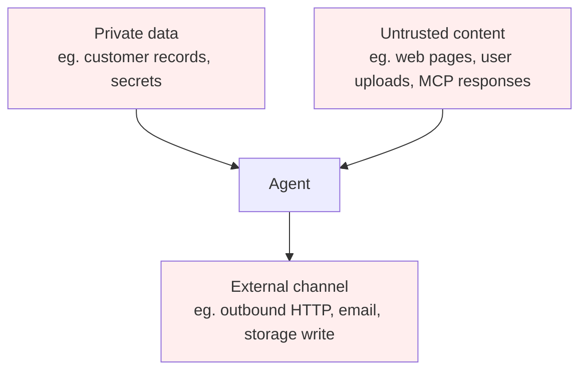

# L50: Toxic Flow Analysis — Unsafe Data Paths in Agentic Systems

**Code:** `12_orchestration/toxic_flow.py`
**Reflection:** [`level-50-reflection.md`](../../.claude/learnings/reflections/level-50-reflection.md)

### Level 50: Toxic Flow Analysis — Unsafe Data Paths in Agentic Systems
**Goal:** Apply toxic flow analysis to detect unsafe data paths in multi-agent architectures where the "lethal trifecta" is present — private data, untrusted content, and external communication all in scope

**Depends on:** L46d (Trust Boundaries — single-turn guardrails), L22 (Safety), L56 (Secure MCP — where the attack surface sits)
**Unlocks:** Architecture-level security analysis for multi-agent and MCP-connected systems

**What ThoughtWorks means by "toxic flow analysis"** (Vol.33, Assess, Nov 2025):

*"When agents communicate with one another — through tool invocation or API calls — they can quickly encounter what's become known as the lethal trifecta: access to private data, exposure to untrusted content and the ability to communicate externally. Agents with all three are highly vulnerable. Because LLMs tend to follow instructions in their input, content that includes a directive to exfiltrate data to an untrusted source can easily lead to data leaks. One emerging technique to mitigate this risk is toxic flow analysis, which examines the **flow graph of an agentic system** to identify potentially unsafe data paths for further investigation."*

This is **architecture-level analysis** of agent graphs — not session-level conversation monitoring. The question is: in the agent's tool-call graph, can untrusted content reach a code path that also has access to private data and an outbound channel?

**The lethal trifecta** (ThoughtWorks Vol.33; also Agentic AI Handbook):



```
+------------------+   +--------------------+   +------------------+
| Private data     |   | Untrusted content  |   | External channel |
| (customer records|   | (web pages, user   |   | (outbound HTTP,  |
|  secrets, keys)  |   |  uploads, MCP resp)|   |  email, write)   |
+--------+---------+   +---------+----------+   +--------+---------+
         \                       |                       /
          \                      v                      /
           +---------------> [Agent] <----------------+
                               |
                    All three present = lethal trifecta
                    LLM follows instructions in untrusted content
                    → directive to exfiltrate private data via external channel
```

**Mitigation** (Agentic AI Handbook, nibzard.com): *"Production move: remove at least one circle — no external network egress, no direct access to secrets, strict input separation."*

**Flow graph analysis — what to check:**
Examine the agent's tool-call graph for paths where all three trifecta elements intersect:
- Which tools read from untrusted sources? (web fetch, file read, MCP tool results)
- Which tools have access to private data? (database reads, secret retrieval, session context)
- Which tools write externally? (HTTP POST, email send, storage write, MCP tool calls)
- Does any reachable path connect all three? That path is a toxic flow.

```
# Pseudocode — flow graph audit for lethal trifecta

# Build tool-call graph from agent definition
graph = build_tool_graph(agent.tools)

# Classify each tool node
untrusted_sources = [t for t in graph.nodes if reads_external_input(t)]
private_data_nodes = [t for t in graph.nodes if accesses_private_data(t)]
exfil_channels    = [t for t in graph.nodes if writes_externally(t)]

# Find paths that traverse all three categories
toxic_paths = []
for src in untrusted_sources:
    for priv in private_data_nodes:
        for dst in exfil_channels:
            if graph.has_path(src, priv) and graph.has_path(priv, dst):
                toxic_paths.append((src, priv, dst))

# Each toxic_path is a candidate for architectural remediation:
# - remove the exfil channel (most common fix)
# - isolate private data to a separate agent with no external tools
# - treat all MCP tool responses as untrusted (structural, not prompt-based)
```

**Note:** ThoughtWorks describes this as "still in its early stages" and "one of several promising approaches." There are no established tools or standard implementations as of Vol.33 (Nov 2025).

**Key Concepts:**
- Toxic flow analysis = flow graph inspection, not session-level conversation monitoring
- The "lethal trifecta": private data + untrusted content + external channel, all reachable by the same agent
- LLMs follow instructions: untrusted content can contain directives to exfiltrate private data via external channel
- Mitigation: remove at least one element of the trifecta architecturally — structural, not prompt-based
- Connection to L56: MCP tool responses are untrusted content by definition; MCP-connected agents face the trifecta
- Connection to L46d: L46d strips injection patterns from a single request; L50 analyses whether the agent *architecture* allows the data path to exist at all — a different layer

**Sources:**
- [ThoughtWorks Radar Vol.33: Toxic Flow Analysis](https://www.thoughtworks.com/radar/techniques/toxic-flow-analysis) ✓ — Assess tier; "lethal trifecta"; flow graph analysis; "still in its early stages"; MCP and agentic attack vectors
- [Agentic AI Handbook (nibzard.com)](https://www.nibzard.com/agentic-handbook) ✓ — lethal trifecta defined; mitigation: "remove at least one circle — no external network egress, no direct access to secrets, strict input separation"

---

---
