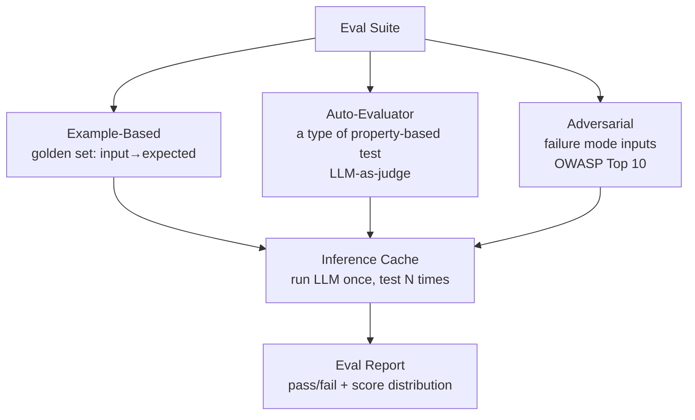

# L51: Evals as Engineering Discipline — Fowler Eval Methodology

**Code:** `13_quality/evals_methodology.py`
**Reflection:** [`level-51-reflection.md`](../../.claude/learnings/reflections/level-51-reflection.md)

### Level 51: Evals as Engineering Discipline — Fowler Eval Methodology
**Goal:** Apply three named test types to LLM systems and decouple inference from testing so model/prompt changes can be evaluated without proportional API cost

**Depends on:** L35 (Strands Evals SDK — understand the Strands-specific tooling first), L49 (Evals Harness — boundary contract testing)
**Unlocks:** L54 (Prompt refactoring — Fowler explicitly ties the two together)

**How this differs from L35 and L49:**
L35 = how to run evals using the Strands SDK. L49 = testing hybrid system boundary contracts (parse rate, override rate). L51 = the *methodology*: what test types to apply to probabilistic systems, and how to run many tests without paying for repeated LLM inference.

**Research basis:** Martin Fowler, ["Engineering Practices for LLM Application Development"](https://martinfowler.com/articles/engineering-practices-llm.html) (martinfowler.com). Martin Fowler, ["Patterns for Building LLM-based Systems & Products"](https://martinfowler.com/articles/gen-ai-patterns/) (martinfowler.com). ThoughtWorks Technology Radar Vol.33 (2026): LLM as a Judge.

**Three test types named in the source:**

| Type | Fowler's description |
|------|---------------------|
| Example-based | Structured JSON output; open-closed principle for scaling by adding test data |
| Auto-evaluator | "using an LLM to test an LLM, and also a type of property-based test" — checks properties/characteristics, not specific output |
| Adversarial | "identified as many failure modes as possible"; OWASP Top 10 for LLM Applications; comprehensive Threat Modelling |

*Note: Fowler describes auto-evaluator as "a type of property-based test" — they are not separate categories in the source.*

**Inference-testing decoupling** (directly quoted from source): "decouple inference and testing, so that you can run inference...once and run multiple property-based tests"



```
# Inference-testing decoupling (Fowler)
outputs = {}
for input in test_corpus:
    outputs[input.id] = llm(input.text)   # ONE LLM call per test case

# Apply all test types to cached outputs — no additional LLM inference calls
example_results = [check_structured_output(o, e.expected) for o, e in zip(outputs, examples)]
auto_results    = [auto_eval_llm(o) for o in outputs.values()]   # LLM-as-judge
adv_results     = [check_adversarial(o, attack) for o, attack in adversarial_pairs]
```

**Prompt refactoring** (Fowler, same article): "Periodic refactoring...is equally crucial when developing LLM applications." "aided by our automated tests, refactoring our prompts was a safe and efficient process." "red-green-refactor cycles." The eval suite enables safe prompt changes — the two practices are explicitly coupled in the source.

**LLM-as-Judge caveats** (ThoughtWorks Vol.33, moved from Trial to Assess): "often fails as a reliable proxy for human judgment" — susceptibility to position bias, verbosity bias, and scaling contamination where "a model family favors its own outputs." ThoughtWorks recommends "LLMs as a jury (employing multiple models for consensus)" but notes this increases costs and complexity. Verdict: "Treat this technique with caution — ensuring human verification, transparency and ethical oversight."

**Key Concepts:**
- Three test types, not four: Fowler describes auto-evaluator as "a type of property-based test" — they are not separate categories
- Inference-testing decoupling: run LLM once per test case, apply all test types to cached output
- "testing may convincingly demonstrate the presence of bugs, but can never demonstrate their absence" (Dijkstra, cited by Fowler in engineering-practices-llm.html)
- Prompt refactoring is paired with eval coverage — automated tests make refactoring safe and efficient
- LLM-as-judge is useful but unreliable as sole evaluator; combine with human eval per Fowler gen-ai-patterns

**Sources:**
- [Martin Fowler: Engineering Practices for LLM Application Development](https://martinfowler.com/articles/engineering-practices-llm.html) ✓ — three test types, inference-testing decoupling, prompt refactoring
- [Martin Fowler: Patterns for Building LLM-based Systems & Products](https://martinfowler.com/articles/gen-ai-patterns/) ✓ — Evals pattern: build pipeline integration, LLM-as-judge + human eval combination, production monitoring
- [ThoughtWorks Radar Vol.33: LLM as a Judge — Assess](https://www.thoughtworks.com/radar/techniques/llm-as-a-judge) ✓ — position bias, verbosity bias, scaling contamination ([arxiv:2502.01534](https://arxiv.org/abs/2502.01534), [arxiv:2404.18796](https://arxiv.org/abs/2404.18796))

---
