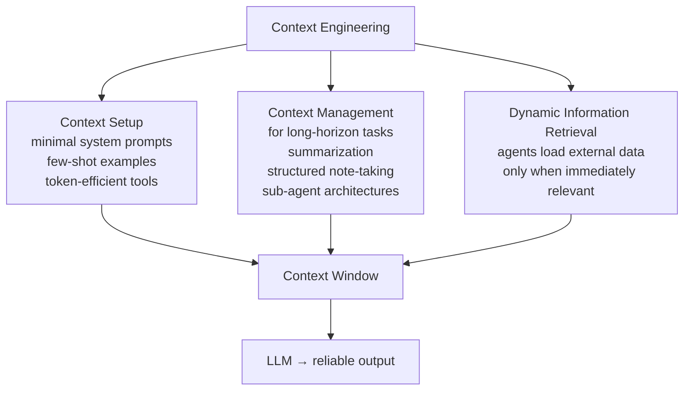

# L53: Context Engineering

**Code:** `13_quality/context_engineering.py`
**Reflection:** [`level-53-reflection.md`](../../.claude/learnings/reflections/level-53-reflection.md)

### Level 53: Context Engineering
**Goal:** Systematically design the information provided to an LLM during inference — addressing three areas ThoughtWorks identifies as distinct from prompt engineering

**Depends on:** L15 (Context Management — understand the token budget), L30 (Skills Plugin — on-demand context loading is one application)
**Unlocks:** Higher output reliability from any downstream level without changing model or code

**How this differs from L15:**
L15 = managing the token budget (compression, summarization). L53 = deciding *what* information fills that budget, and how it is structured.

**Research basis:** ThoughtWorks Technology Radar Vol.33 (2026), Assess tier, published November 5, 2025. Definition: "Context engineering is the systematic design and optimization of the information provided to a large language model during inference to reliably produce the desired output." The entry distinguishes this from prompt engineering: it considers "the entire configuration of context: how relevant knowledge, instructions and prior context are organized and delivered."

**Three areas identified by ThoughtWorks:**

| Area | What it covers |
|------|---------------|
| Context Setup | Minimal system prompts, few-shot examples, token-efficient tools |
| Context Management for Long-Horizon Tasks | Summarization, structured note-taking, sub-agent architectures to handle finite context windows |
| Dynamic Information Retrieval | "Agents autonomously load external data only when immediately relevant" — just-in-time context retrieval |



```
# Three areas from ThoughtWorks (pseudocode, not from source)

# Area 1: Context Setup
agent = Agent(
    system_prompt=minimal_system_prompt,   # minimal per ThoughtWorks
    tools=token_efficient_tools,            # token-efficient tool descriptions
    few_shot_examples=examples,
)

# Area 2: Context Management for Long-Horizon Tasks
# (connects to L15 compression + L30 skills plugin on-demand loading)
if context_too_long:
    context = summarize(older_turns) + structured_notes + recent_turns

# Area 3: Dynamic Information Retrieval
# (connects to L45 Agentic RAG — retrieve only when needed, not always)
if agent_needs_external_data:
    context += retrieve_just_in_time(query)
```

**Key Concepts:**
- ThoughtWorks definition distinguishes context engineering from prompt engineering by scope: prompt engineering addresses one component; context engineering addresses the full configuration
- Three areas per ThoughtWorks: setup, long-horizon management, dynamic retrieval
- Connects to L15 (compression = context management), L30 (skills = on-demand setup), L45 (agentic RAG = dynamic retrieval)
- ThoughtWorks verdict: Assess — evaluate for your situation; the practice is emerging and not yet standardised

**Sources:**
- [ThoughtWorks Radar Vol.33: Context Engineering — Assess](https://www.thoughtworks.com/radar/techniques/context-engineering) ✓ — definition, three areas, distinction from prompt engineering
- References cited in ThoughtWorks entry: Anthropic engineering documentation, LangChain blog on context engineering

---
