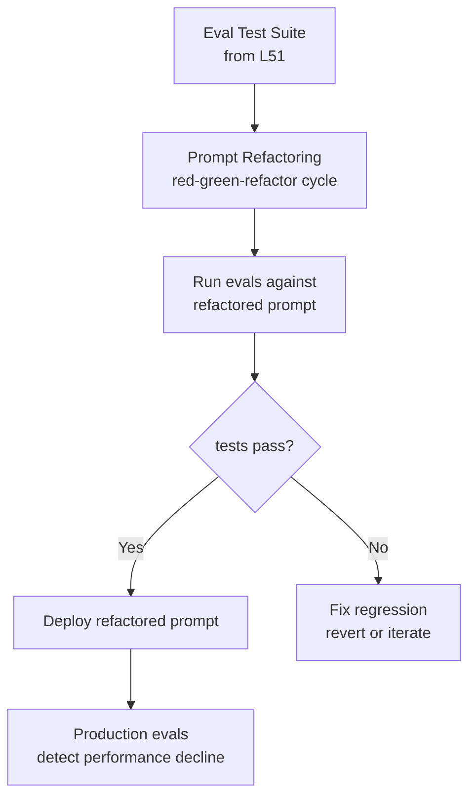

# L54: Prompt Management — Prompt Refactoring

**Code:** `13_quality/prompt_management.py`
**Reflection:** [`level-54-reflection.md`](../../.claude/learnings/reflections/level-54-reflection.md)

### Level 54: Prompt Management — Prompt Refactoring
**Goal:** Apply refactoring discipline to prompts, using automated eval coverage as the safety net — the same way tests enable safe code refactoring

**Depends on:** L51 (Evals Methodology — automated tests are the precondition Fowler states explicitly)
**Unlocks:** Safe prompt iteration without manual regression testing

**Research basis:** Martin Fowler, ["Engineering Practices for LLM Application Development"](https://martinfowler.com/articles/engineering-practices-llm.html). Fowler's stated point: "aided by our automated tests, refactoring our prompts was a safe and efficient process." He applies the red-green-refactor cycle to prompts: write tests first, refactor against them, verify the tests still pass.

**What the source says:**

Fowler states: "LLM prompts can easily become messy over time, and often more rapidly so." "Periodic refactoring...is equally crucial when developing LLM applications." "Refactoring keeps our cognitive load at a manageable level." "aided by our automated tests, refactoring our prompts was a safe and efficient process." He notes: "different LLMs may require slightly varied prompt syntaxes" — meaning prompt changes aren't always transferable across models.

The coupling is explicit: the eval suite from L51 is what makes prompt refactoring safe. Without automated test coverage, prompt changes carry unquantified regression risk.

From Fowler's gen-ai-patterns: the Evals pattern includes "running regular evaluations on deployed production systems to detect performance decline" — this is the production monitoring complement to the development-time refactoring cycle.



```
# Pseudocode based on Fowler's red-green-refactor for prompts

# Precondition: eval suite exists (L51)
baseline_pass_rate = run_evals(current_prompt, test_corpus)

# Refactor the prompt (e.g. restructure sections, rename variables, clarify constraints)
refactored_prompt = refactor(current_prompt)

# Verify evals still pass — same cycle as code refactoring
new_pass_rate = run_evals(refactored_prompt, test_corpus)
assert new_pass_rate >= baseline_pass_rate, "Regression detected"

# Note (Fowler): different LLMs may require different prompt syntax —
# test against the target model, not a proxy
```

**Key Concepts:**
- Automated test coverage is the stated precondition for safe prompt refactoring (Fowler)
- Red-green-refactor applies to prompts: write tests → change prompt → verify tests pass
- "LLM prompts can easily become messy over time" — same entropy as code, requires same discipline
- Different LLMs may require different prompt syntax — Fowler explicitly warns about this
- Scope: Fowler describes the refactoring practice; a full prompt CI/CD pipeline (canary, rollback) is not described in the available source material

**Sources:**
- [Martin Fowler: Engineering Practices for LLM Application Development](https://martinfowler.com/articles/engineering-practices-llm.html) ✓ — prompt refactoring, red-green-refactor cycle, automated tests as safety net
- [Martin Fowler: Patterns for Building LLM-based Systems & Products](https://martinfowler.com/articles/gen-ai-patterns/) ✓ — Evals pattern: production monitoring for performance decline

---
