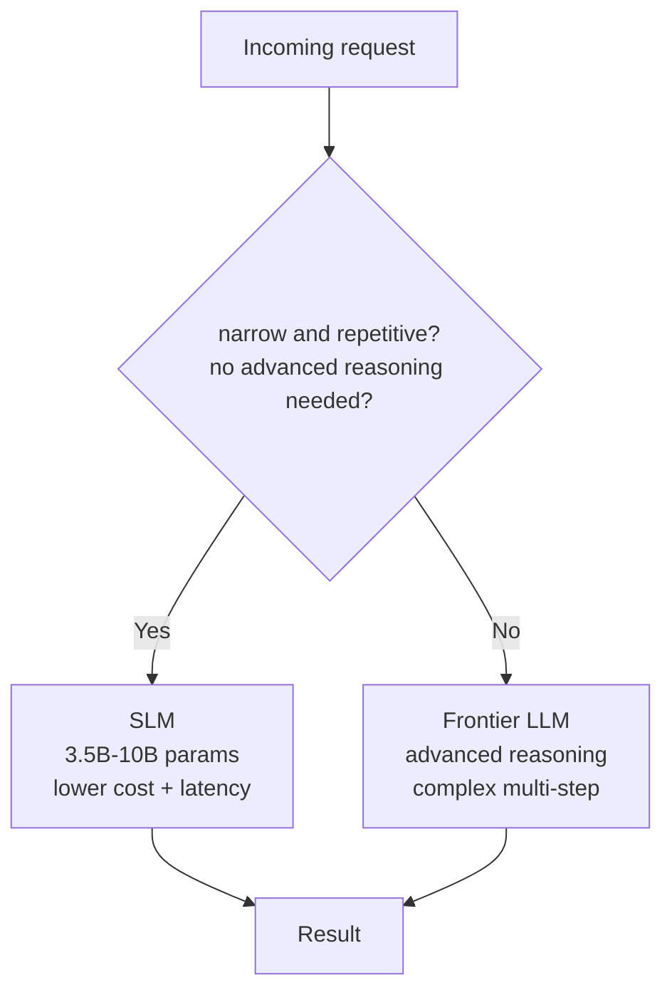

# L55: Small Language Model Routing

**Code:** `13_quality/slm_routing.py`
**Reflection:** [`level-55-reflection.md`](../../.claude/learnings/reflections/level-55-reflection.md)

### Level 55: Small Language Model Routing
**Goal:** Use SLMs (3.5B–10B parameters) as the default model for narrow, repetitive agentic tasks; escalate to frontier LLMs only for tasks requiring advanced reasoning

**Depends on:** L28 (SDK Advances — parallel tool dispatch), L46 (Hybrid LLM/Deterministic — routing is a hybrid pattern)
**Unlocks:** Cost-efficient production architecture where SLM is the default, frontier LLM is the exception

**Research basis:** ThoughtWorks Technology Radar Vol.33 (2026), **Assess** tier, published November 5, 2025. ThoughtWorks states SLMs have "fewer weights and less precision, usually between 3.5 billion and 10 billion parameters." They note: "recent research suggests that, in the right context, when set up correctly, SLMs can perform as well as or even outperform LLMs." They explicitly recommend: "consider SLMs as the default choice for agentic workflows." Qualifying condition: "narrow, repetitive tasks that don't require advanced reasoning."

**Models mentioned in ThoughtWorks entry:** Phi-3, SmolLM2, DeepSeek (distilled Qwen/Llama variants), Meta Llama 3.2 (1B and 3B), Microsoft Phi-4 (14B), Google PaliGemma 2 (3B/10B/28B vision-language), Gemini Nano.



```
# Pseudocode based on ThoughtWorks guidance

# ThoughtWorks: "consider SLMs as the default choice for agentic workflows"
# Qualifying condition: "narrow, repetitive tasks that don't require advanced reasoning"

# L40 connection: LlamaCppModel can run SLMs locally (3B-8B range)
slm_model  = get_model("phi-3")           # local via LlamaCppModel (L40)
llm_model  = get_model("claude-sonnet-4") # frontier for complex tasks

# The routing decision itself is a narrow, repetitive task
# — SLM as its own router is consistent with ThoughtWorks guidance
```

**Key Concepts:**
- ThoughtWorks ring is **Assess** (not Trial): evaluate for your situation; it's not yet in Trial
- Stated qualifying condition: "narrow, repetitive tasks that don't require advanced reasoning"
- ThoughtWorks recommendation: SLM as default, not exception
- Parameter range per ThoughtWorks: "usually between 3.5 billion and 10 billion parameters" (note: Phi-4 at 14B exceeds this range — ThoughtWorks lists it as an example regardless)
- Connection to L40: `LlamaCppModel` enables local SLM inference — SLMs at edge + frontier LLM in cloud is the L40 two-tier architecture

**Sources:**
- [ThoughtWorks Radar Vol.33: Small Language Models — Assess](https://www.thoughtworks.com/radar/techniques/small-language-models) ✓ — definition, parameter range, model examples, recommendation as default for agentic workflows
- [Strands llama.cpp provider docs](https://strandsagents.com/docs/user-guide/concepts/model-providers/llamacpp/) ✓ — local SLM inference via L40 pattern

---
