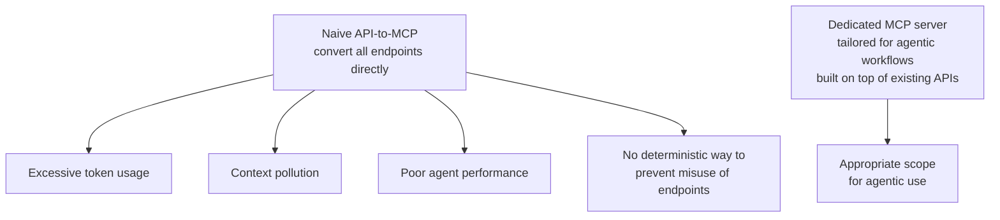

# L56: Secure MCP Architecture

**Code:** `13_quality/secure_mcp.py`
**Reflection:** [`level-56-reflection.md`](../../.claude/learnings/reflections/level-56-reflection.md)

### Level 56: Secure MCP Architecture
**Goal:** Architect a dedicated MCP server for agentic access instead of naively converting existing internal APIs — addressing the specific failure modes ThoughtWorks identifies

**Depends on:** L9 (MCP Integration — understand the protocol), L22 (Safety & Guardrails — understand the threat model)
**Unlocks:** Production-safe agentic integrations with external services

**Research basis:** ThoughtWorks Technology Radar Vol.33 (2026), **Hold** tier, published November 5, 2025. ThoughtWorks on the anti-pattern: "APIs are typically designed for human developers and often consist of granular, atomic actions that, when chained together by an AI, can lead to excessive token usage, context pollution, and poor agent performance." On security: "when APIs are naively exposed to agents via MCP, there's no reliable, deterministic way to prevent an autonomous AI agent from misusing such endpoints." Recommended approach: "architect a dedicated, secure MCP server specifically tailored for agentic workflows, built on top of your existing APIs." Related tool mentioned: FastAPI-MCP.

**The anti-pattern and its consequences (per ThoughtWorks):**



```
# ANTI-PATTERN per ThoughtWorks:
# "granular, atomic actions that, when chained together by an AI,
#  can lead to excessive token usage, context pollution,
#  and poor agent performance"
naive_mcp = convert_all_endpoints(internal_api)   # exposes full API surface

# RECOMMENDED per ThoughtWorks:
# "architect a dedicated, secure MCP server specifically tailored
#  for agentic workflows, built on top of your existing APIs"
dedicated_mcp = MCPServer()
dedicated_mcp.add_tool(agent_appropriate_tool_1)
dedicated_mcp.add_tool(agent_appropriate_tool_2)
# Built on top of internal_api, not a direct conversion of it
```

**Key Concepts:**
- ThoughtWorks names three specific consequences of naive conversion: excessive token usage, context pollution, poor agent performance — not just security
- The security concern is specific: "no reliable, deterministic way to prevent an autonomous AI agent from misusing" endpoints when they are naively exposed
- ThoughtWorks recommended pattern: dedicated MCP server *tailored for agentic workflows*, built *on top of* existing APIs — not a wrapper around them
- FastAPI-MCP is mentioned as a related tool in the ThoughtWorks entry
- vs L9: L9 shows how to consume existing MCP servers; L56 is about how to design one correctly for agents
- ThoughtWorks verdict: **Hold** — do not do this; the design mismatch between APIs-for-humans and APIs-for-agents is fundamental

**Sources:**
- [ThoughtWorks Radar Vol.33: Naive API-to-MCP Conversion — Hold](https://www.thoughtworks.com/radar/techniques/naive-api-to-mcp-conversion) ✓ — full description, three failure modes, recommended approach, FastAPI-MCP reference
- [Strands MCP Integration docs](https://strandsagents.com/docs/user-guide/concepts/tools/mcp-tools/) ✓

---
