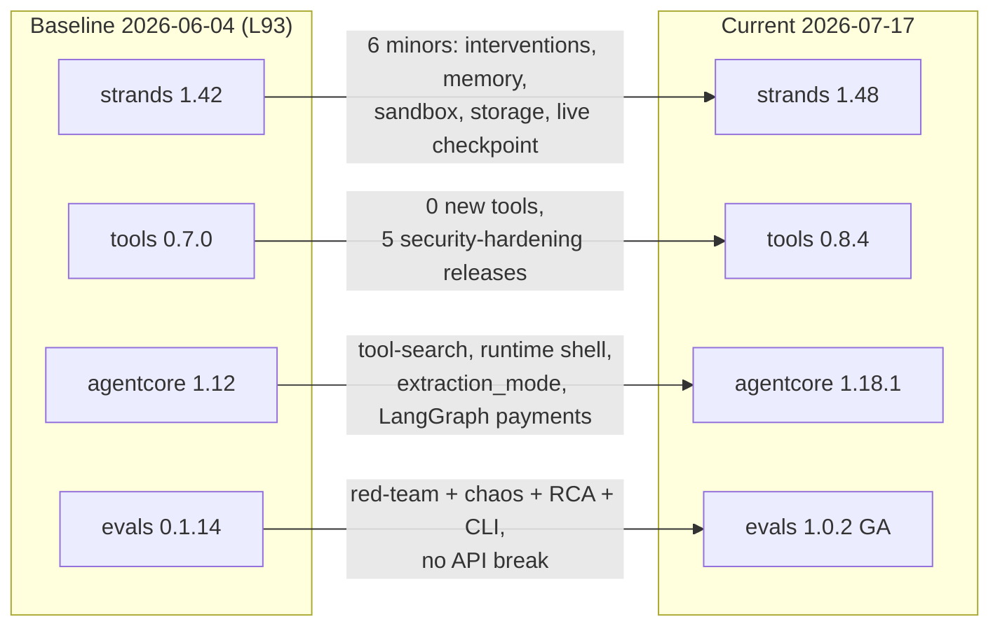
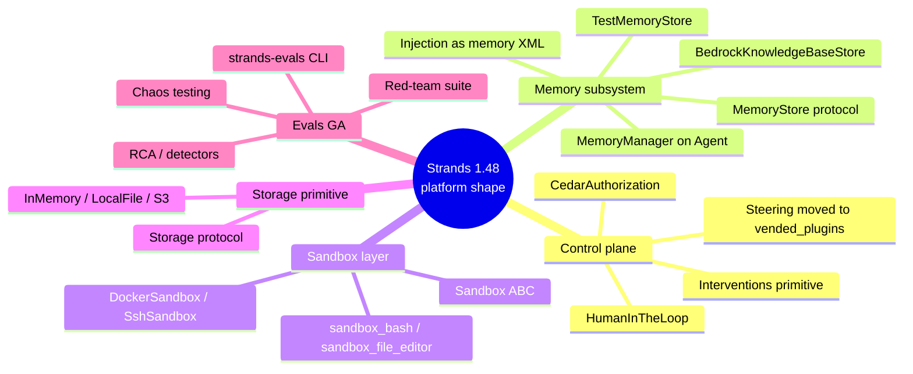
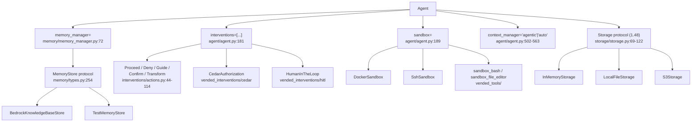
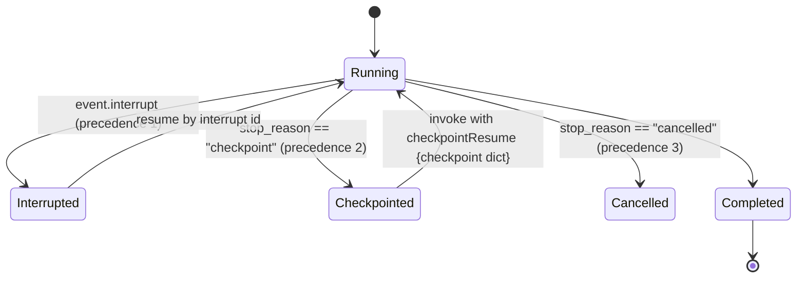
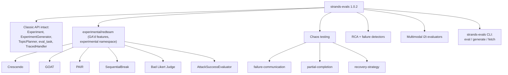
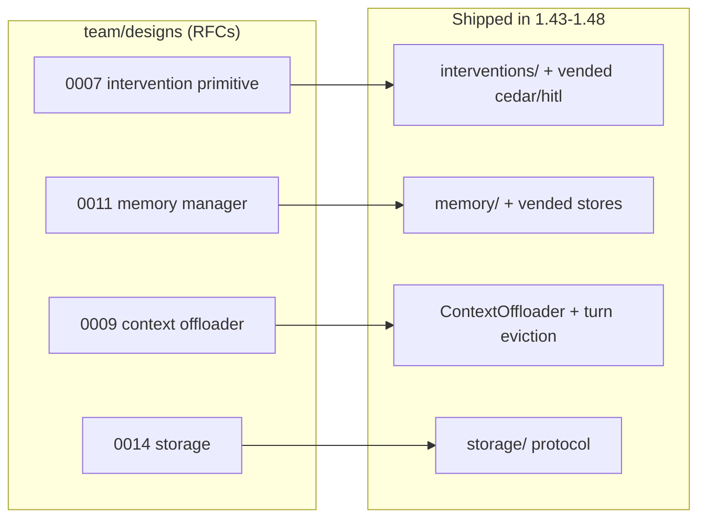

# Strands Ecosystem Delta — v1.42 → v1.48 (2026-06-02 → 2026-07-17)

**Date:** 2026-07-18
**Purpose:** discrete record of everything that changed in the Strands/AgentCore ecosystem between
this repo's last validated baseline (L93, 2026-06-04) and today. Input to the L94+ lesson-plan
extension decision.

## Method and sources

Three parallel read-only explorations, consolidated here losslessly:

1. **Core SDK**: fresh clone of the `strands-agents/sdk-python` monorepo at
   `~/Code/strands-sdk-python`, HEAD `41f9f59b` (2026-07-17). 152 commits touching `strands-py`
   between tags `python/v1.42.0` and `python/v1.48.0` were inventoried; key modules read at HEAD.
   All `file:line` citations below are relative to `strands-py/src/strands/` at `python/v1.48.0`
   unless noted.
2. **Monorepo meta**: same clone — `strandly/`, `team/`, `test-infra/`, `strands-ts/` (tags
   `typescript/v1.4.0` → `v1.10.0`), `site/` additions since 2026-06-01, root `AGENTS.md`.
3. **Ecosystem packages**: GitHub release notes for `strands-agents/tools` (0.7.0 → 0.8.4),
   `aws/bedrock-agentcore-sdk-python` (1.12 → 1.18.1), `strands-agents/evals` (0.1.14 → 1.0.2),
   with the evals claim verified against the v1.0.2 source tree. PyPI versions verified
   2026-07-18 via `pypi.org/pypi/<pkg>/json`.
4. **External coverage** (section 9): two web-research passes over AWS blogs, What's New, the
   Strands blog, third-party writeups, and YouTube — written sources verified by fetching each
   page; video metadata carries snippet-level confidence only (noted inline).

The old clone at `~/Documents/Code/strands-sdk-python` was unusable (OneDrive dataless-stub damage;
file reads hang) and was replaced, not repaired.

## Baseline vs current

| Package | Repo baseline (L93) | Current (2026-07-17) | Releases in gap |
|---------|--------------------|---------------------|-----------------|
| strands-agents | 1.42.0 | 1.48.0 | 6 minors |
| strands-agents-tools | 0.7.0 | 0.8.4 | 5 patches (hardening only) |
| bedrock-agentcore | 1.12 | 1.18.1 | 6 minors + patches |
| strands-agents-evals | 0.1.14 | 1.0.2 | 9 releases incl. 1.0 GA |

## The shape of the change

Strands grew from an agent loop with add-ons into a platform with a **control plane**
(interventions), a **memory subsystem**, a **sandbox layer**, and a **unified storage primitive**
— four capabilities this repo currently hand-builds (L78–L82 memory behind hexagonal ports; L22/L29/
L33/L47/L70 as separate control stories; L24's ad-hoc sandboxing; per-subsystem persistence).
Meanwhile evals went GA with adversarial machinery, the tools package froze features in favour of
security hardening, and AgentCore iterated incrementally.

---

## 1. Core Python SDK — 1.43 → 1.48

Six new top-level namespaces since 1.42: `memory/`, `interventions/`, `sandbox/`, `storage/`,
`injection/`, plus internal `_middleware/` and `_context_manager/`, and three vended packages
`vended_interventions/`, `vended_memory_stores/`, `vended_tools/`. Experimental `steering` was
deprecated and moved to production (`vended_plugins`).

### Release-by-release (commits cited)

**v1.43.0**
- Checkpoint auto-runtime wired into the event loop (`cbd4f03a`) — see tracked-features below.
- Interventions primitive with cancellation (`7e4f5cba`) — new `interventions/`.
- Sandbox core abstraction (`fb4a2e41`) + Docker/SSH implementations (`5f4257f8`) — new `sandbox/`.
- Message pinning in conversation managers (`43cc86e8`): `conversation_manager/compression/pin_message.py`.
- `model_state` as a snapshot field (`9a6be270`); a2a uses native snapshot (`f133bbf8`).
- `context_manager="auto"` facade on Agent (`4ba1f198`).
- Optional hook ordering — new `HookOrder` class + `order=` kwarg on `add_callback` (`6dd249da`).
- `claude-opus-4-8` added to context-window limits (`dc10b50d`).
- Fixes: `count_tokens` includes JSON blocks (`8f4a8ebe`); a2a agent-factory context isolation (`398343fa`).

**v1.44.0 (memory + agent-control release)**
- Memory manager + extraction ported (`713a6de3`); `Agent(memory_manager=...)` with configurable
  sync auto-flush (`6a2445f6`); memory injection (`a111c5d2`); default extraction trigger (`6f9cae05`).
- `BedrockKnowledgeBaseStore` ported (`ac7aab32`) — new `vended_memory_stores/`.
- Cedar authorization handler (`1f50d374`) + HumanInTheLoop (`8a509cf1`) — new `vended_interventions/`.
- Agentic context management ported (`fbfd898c`) — new `_context_manager/modes/agentic/`.
- Internal middleware system for `InvokeModelStage` (`2eafc765`) — new `_middleware/`.
- Sandbox integrated with Agent (`fa2c75d2`) + vended sandbox tools/plugins (`1b8cd9ff`) — new
  `vended_tools/` (`bash`, `file_editor`).
- GraphBuilder: `invocation_state` passed to edge-condition calls (`a92502f5`).
- GoalLoop vended plugin (`abda2588`); context-offloader turn-based eviction (`fd2daad5`).

**v1.45.0**
- `mistralai` 2.x support (`57cb09cc`) — breaking `feat(models)!`.
- Per-invocation idempotency via `idempotency_token` (`226b3ec8`).
- MCP progress notifications (`65f7a384`).
- Managed Bedrock KB in retrieve + ACL; `initialize()` introduced in MemoryStores (`73a2a46a`).
- Offloader search/grep (`4bc9a241`); `BedrockModel.format_request` public (`5c1247e2`); bidi image
  input via `BidiImageInputEvent` (`e41f5150`).

**v1.46.0**
- Load MCP servers from JSON (`eb654d5c`).
- Local memory store added (`84fff9a9`) — renamed next release.
- Middleware: result handling, model-state isolation, system-prompt fidelity (`bc3d96a8`).
- Memory: per-message sequence numbers to `add_messages` (`e050fc8b`); memory-manager telemetry (`d9b90614`).

**v1.47.0**
- Span redaction for telemetry (`2d6e6502`).
- `continue_on_error` on MCP client (`b2662d3d`).
- `LocalMemoryStore` → `TestMemoryStore` (`6c58f97c`) — breaking `fix(memory)!`.
- Durable message identifiers — `tracking_id` on messages (`a1915b6c`).

**v1.48.0**
- Unified storage interface (`1aff2707`) — new `storage/` (`Storage` protocol + in-memory/local-file/S3).
- `gen_ai_span_attributes_only` env var for telemetry (`b1e1c2ba`).
- `client_name` on `MCPClient` for `clientInfo` (`612f47f7`).
- Fix: symlink-attack prevention in `FileSessionManager` (`8658b9e0`).
- Docs only: Bedrock `strict_tools` schema constraints documented (`7fb9a306`) — feature predates 1.42.

### Fate of the features this repo tracked at 1.42

- **Checkpoint — now a live runtime, not types-only.** At 1.42, `event_loop.py` and
  `agent_result.py` had zero `checkpoint` refs. Now: `AgentResult.checkpoint: Checkpoint | None`
  (`agent/agent_result.py:41`), populated only when `stop_reason == "checkpoint"`
  (`agent_result.py:30-32`), serialized in `to_dict`/`from_dict` (`agent_result.py:109-110,130`).
  `"checkpoint"` is a `StopReason` literal (`types/event_loop.py:42`), alongside new `"cancelled"`.
  Resume: pass `{"checkpointResume": {"checkpoint": ckpt.to_dict()}}`
  (`experimental/checkpoint/checkpoint.py:16`). Precedence: interrupt > checkpoint > cancel
  (`checkpoint.py:18-22`). `Checkpoint` dropped `snapshot`/`app_data` (`d1f5480e`); now only
  `position` (`after_model`/`after_tools`) + `cycle_index` (`checkpoint.py:55-56`). It captures
  pause position, not conversation state — still pair with a `SessionManager`.

- **Interrupts — unchanged since 1.42.** `interrupt.py` identical diff; `event.interrupt`,
  `result.interrupts` (`agent_result.py:39`) behave as before.
- **`count_tokens` — not a bare chars/4 heuristic at HEAD.** Base `Model.count_tokens` uses
  tiktoken `cl100k_base` when available, falling back to chars/4 (text) / chars/2 (JSON)
  (`models/model.py:266-292`). Native APIs behind `use_native_token_count` for Anthropic
  (`models/anthropic.py:402`) and Bedrock (`models/bedrock.py:843`). Only in-range change: JSON
  blocks now counted (`8f4a8ebe`). See Corrections below re L61.
- **`Limits` invocation caps — present, unchanged shape** (`types/agent.py:17-45`); stop reasons
  `limit_turns`/`limit_total_tokens`/`limit_output_tokens` in the literal.
- **MultiAgentPlugin — present, pre-1.42, unchanged** (`plugins/multiagent_plugin.py:1-30`).
- **Steering — deprecated and relocated.** `experimental/steering/__init__.py` is a compat shim
  emitting `DeprecationWarning`, redirecting to `strands.vended_plugins.steering`.
- **bidi — refinements, no overhaul.** 8 kHz sample rate (`AudioSampleRate` literal) +
  `BidiConnectionRestartEvent` (`ea3ce9df`); OpenAI image input via `BidiImageInputEvent`
  (`e41f5150`); transcript role validation (`b8d03eac`); Nova Sonic region/user-agent fixes.
- **Swarm / GraphBuilder.** Swarm essentially unchanged (9-line diff);
  `repetitive_handoff_detection_window` as before (`multiagent/swarm.py:194`). GraphBuilder gained
  `invocation_state`-aware edge conditions: new exports `EdgeCondition`,
  `EdgeConditionWithContext`; `add_edge` accepts `(state, *, invocation_state) -> bool`,
  auto-detected by signature so old conditions still work (`multiagent/graph.py:67-102,335-345`).
- **Structured output — fixes only** (`ffe4f5d4`, `e955e450`); no API-shape change.
- **CachePoint / strict_tools — present, unchanged shape** (`types/content.py:66,95,115`;
  `models/bedrock.py:127-131,287,306-310`). In-range fix: cache point placed before non-PDF
  document blocks (`beddc3f7`).
- **Session managers.** `FileSessionManager` hardened against symlink attacks (`8658b9e0`),
  encodes bytes in `SessionAgent.to_dict()` (`fd5ced1e`); `repository_session_manager.py` repairs
  mid-iteration orphaned `toolUse` skips (`f282b616`). `S3SessionManager` largely untouched.

### New capabilities — entry points for study

- **Agentic memory** — `MemoryManager(stores=[...], search_tool_config, add_tool_config, injection)`
  (`memory/memory_manager.py:72`); `Agent(memory_manager=...)` (`agent/agent.py:183`). Sync
  `Agent(...)` auto-flushes extraction after each call; `invoke_async` does not
  (`agent/agent.py:773-784`). Triggers: `InvocationTrigger` (every turn) or `IntervalTrigger(turns)`,
  default every 5 turns (`memory/extraction/triggers.py`, `resolve_extraction_config.py:25`).
  Stores implement the `MemoryStore` Protocol (`search` required; `add`/`add_messages`/`initialize`/
  `get_tools` optional — `memory/types.py:254`). Memory injected as `<memory>` XML folded into the
  last user message, not the system prompt (`injection/_message_injection.py`,
  `memory/memory_manager.py:647`).
- **Interventions** — override any of `before_invocation`/`before_tool_call`/`after_tool_call`/
  `before_model_call`/`after_model_call`, sync or async (`interventions/handler.py:43-107`).
  Actions: `Proceed`, `Deny`, `Guide`, `Confirm` (human approval, tool-call only), `Transform`
  (in-place edit) (`interventions/actions.py:44-114`). Vended: `CedarAuthorization` via `cedarpy`
  (`vended_interventions/cedar/cedar_authorization.py:71`), `HumanInTheLoop` (interrupt/resume or
  inline `ask` — `vended_interventions/hitl/hitl.py`).
- **Sandbox** — default `NotASandboxLocalEnvironment` (host, no isolation). `Sandbox` ABC has six
  abstract ops: `execute_streaming`, `execute_code_streaming`, `read_file`, `write_file`,
  `remove_file`, `list_files` (`sandbox/base.py:36-205`). `DockerSandbox` and `SshSandbox` extend
  `PosixShellSandbox`. Vended `sandbox_bash` + `sandbox_file_editor` route through
  `context.agent.sandbox`.
- **Unified storage (1.48)** — `Storage` runtime-checkable Protocol: `write`/`read`/`delete`/`list`
  over `bytes` (`storage/storage.py:69-122`).
- **Internal middleware** — `_middleware/`, not public (via `agent._middleware_registry`); only
  `InvokeModelStage` implemented, Input/Wrap/Output phases; `model_state` deliberately excluded
  (`_middleware/README.md`, `_middleware/stages.py:35`).
- **Agentic context management** — `Agent(context_manager="agentic")` injects
  `summarize_context`/`truncate_context`/`pin_context` tools + a `<context-status>` token-usage
  middleware so the model self-compresses (`_context_manager/modes/agentic/agentic_context.py`).
  `"auto"` wires `SummarizingConversationManager` + in-memory `ContextOffloader`. Both conflict
  with a stateful model.
- **Telemetry** — opt-in span redaction: `gen_ai_span_attributes_only` +
  `gen_ai_unredacted_attributes=<globs>`; unredacted by default (`telemetry/tracer.py:93-173`).
  Dropped misleading `gen_ai.agent.name` from multiagent spans (`54a89486`); records `tool_trace`
  on interrupted tool calls (`531d526a`).
- **MCP client** — `client_name`/`application_name` for `clientInfo` (`612f47f7`),
  `continue_on_error` per server (`tools/mcp/mcp_client.py:218`), `progress_callback`
  (`mcp_client.py:220`), load servers from JSON with `disabled`/`continue_on_error` keys (`eb654d5c`).
- **Durable message IDs** — messages carry a `tracking_id` UUID surviving session save/restore +
  snapshots (`types/content.py:236-264`).

### Breaking changes / deprecations (core SDK)

- `feat(models)!` mistralai 2.x (`57cb09cc`): Mistral provider targets mistralai 2.x.
- `fix(memory)!` `LocalMemoryStore` → `TestMemoryStore` (`6c58f97c`): class + package path renamed;
  no `LocalMemoryStore` symbol remains.
- `Checkpoint` dropped `snapshot`/`app_data` (`d1f5480e`).
- `experimental.steering` deprecated → `strands.vended_plugins.steering` (`DeprecationWarning`).
- `cache_prompt` deprecated (pre-existing) — use `SystemContentBlock` + `cachePoint`.
- Dependency-range shifts that can break lockfiles: `litellm` upper bound moved to `<2.0.0` then
  reverted to `<=1.91.1` (`ba89c8f9`, `298c6ed7`); `google-genai` to `<3.0.0`; `writer-sdk` to `<4.0.0`.

---

## 2. strands-agents-evals — 0.1.14 → 1.0.2 (GA)

**Key finding: 1.0.0 is NOT an API rewrite.** Verified in the v1.0.2 source tree: the entire 0.1
surface this repo uses is still exported — `Experiment`, `ExperimentGenerator` (`generators/`),
`TopicPlanner` (`generators/topic_planner.py`), `ToolSelectionAccuracyEvaluator`,
`GoalSuccessRateEvaluator`, `eval_task`/`EvalTaskHandler`/`TracedHandler` (top-level `__init__`).
The GA is a maturity/versioning milestone (red-team GA), not a break of the classic API. Note
`@eval_task`/`TracedHandler` actually landed in 0.1.16, just after this repo's 0.1.14 baseline.

Per release:
- v0.1.15 (2026-04-17): `CorrectnessEvaluator` (trace-based + reference-based); OpenSearchProvider
  + OpenSearchSessionMapper.
- v0.1.16 (2026-04-30): `@eval_task` decorator + `EvalTaskHandler`; detectors interface +
  failure_detector; Model type on HarmfulnessEvaluator.
- v0.1.17 (2026-05-08): multimodal (image-to-text) evaluators + prompt templates; RCA —
  `analyze_root_cause` integrated into eval workflow (RCAItem; confidencelevel/diagnose_trigger →
  enums); new RefusalEvaluator, StereotypingEvaluator, InstructionFollowingEvaluator;
  ToolSimulator optional `tools` param; **default judge model → Claude Sonnet 4.6**.
- v0.2.0 (2026-05-14): structured_output for ActorSimulator; strands-reviewer workflow;
  DiagnosisTrigger export.
- v0.2.1 (2026-05-29): chaos testing module (fault injection); evals-skills bundle.
- v0.3.0 (2026-06-12): built-in red teaming (experimental/redteam); chaos-resilience evaluators
  (failure-communication, partial-completion, recovery-strategy); Crescendo multi-turn attack;
  the `strands-evals` CLI (single-case eval + generate); trace-based evaluators added to defaults;
  **report now always flattened**; EvaluationReport importable from root.
- v1.0.0 (2026-06-16): red-team GA — GOAT, PAIR, SequentialBreak, Bad Likert Judge multi-turn
  attack strategies; async cases execution; RedTeamExperiment; per-risk-category judge rubrics;
  simulator input → AgentInput.
- v1.0.1 (2026-06-25): CLI `fetch` command (pull traces from different sources);
  refusal/helpfulness prompt updates (tool params now in eval prompt).
- v1.0.2 (2026-07-09): fix(redteam) rename structured-output models off leading underscore.

Net-new: red-team suite (`strands_evals/experimental/redteam/` — RedTeamExperiment,
generators/adversarial, evaluators/attack_success_evaluator; **still `experimental/` despite the
1.0 package version**); chaos/fault-injection + chaos-resilience evaluators; RCA/failure detectors;
multimodal evaluators; new evaluator classes not in the 0.1.14 vocabulary: Coherence, Conciseness,
Correctness, ResponseRelevance, ToolParameterAccuracy, Interactions, plus deterministic
Contains/Equals/StartsWith/StateEquals/ToolCalled; full `strands-evals` CLI (eval, generate, fetch).

Behavior changes that shift scores: default judge model now Claude Sonnet 4.6 (0.1.17); report
always flattened (0.3.0); simulator/ActorSimulator input switched to AgentInput (1.0.0);
confidencelevel/diagnose_trigger became enums (0.1.17).

---

## 3. bedrock-agentcore — 1.12 → 1.18.1

Substantive items per release (release bodies mostly point at CHANGELOG + PR lists):
- v1.13.0 (2026-06-02): AgentCore **tool-search plugin for Strands Agents**.
- v1.14.0 (2026-06-05): **interactive runtime shell** support.
- v1.14.1 (2026-06-11): a2a-sdk capped `<1.0` to restore A2A server startup; `requests` moved to an
  optional `datasets` extra; x402 payments "extension"→"extensions" typo fix.
- v1.15.0 (2026-06-17): mostly CI/test ("NY summit" release).
- v1.15.1 (2026-06-25): evaluation-module work — `evaluationReferenceInputs` on EvaluatorInput;
  KMS/tags/online-data-source/updated_at on batch eval; `EvaluatorOutput.label` made optional;
  memory: guard `retrieve_customer_context` on empty content, correct `score` field for relevance
  filtering; **removed an invalid CLI entrypoint from pyproject.toml**.
- v1.16.0 (2026-06-30): **`extraction_mode` parameter on `MemoryClient.create_event`**.
- v1.17.0 (2026-07-02): fix(runtime) prevent streaming-bridge deadlock on client disconnect.
- v1.18.0 (2026-07-10): payments **LangGraph integration**; memory events ordered/floored to
  millisecond resolution.
- v1.18.1 (2026-07-17): tighten package-specifier validation in `install_packages()`; dep bumps
  incl. starlette 0.49 → 1.3.1.

Top-level modules at v1.18.1 (verified in source): `config_bundle`, `evaluation`, `gateway`,
`identity`, `knowledge_base`, `memory`, `payments`, `policy`, `runtime`, `services`, `tools`.
Versus this repo's known set, three names looked like new territory: **`evaluation`,
`knowledge_base`, `policy`** — but only `knowledge_base` is actually new in the gap
(`evaluation` dates to v1.1.1, `policy` to v1.10.0), and `code_interpreter`/`browser` were never
relocated (always under `tools/`); `registry` has never been an SDK module at all. Full evidence
in section 8.

Breaking/behavior: console-script entrypoint removed (1.15.1); a2a-sdk capped <1.0 (1.14.1);
`requests` now optional extra (1.14.1); starlette major bump (1.18.1); `EvaluatorOutput.label`
optional (1.15.1).

---

## 4. strands-agents-tools — 0.7.0 → 0.8.4

**Zero new tools.** Every 0.8.x release is bug-fix / security hardening. Per release:
- v0.8.0 (2026-06-03): code_interpreter blob support in `write_files` (binary uploads); shell
  `non_interactive` driven by env var; mongodb_memory env vars take precedence over tool params.
- v0.8.1 (2026-06-16): code_interpreter custom boto3 session (cross-account); http_request default
  timeout (no more indefinite blocking); `STRANDS_NON_INTERACTIVE` added to PROTECTED_VARS.
- v0.8.2 (2026-06-25): http_request `proxies` **removed from LLM-controllable input schema**;
  generate_image extension follows requested output_format; CI actions sha-pinned.
- v0.8.3 (2026-07-09): security cluster — calculator blocks sympify string-eval escape; memory
  binds tenant namespace out of LLM-controllable inputs; `STRANDS_DISABLE_LOAD_TOOL` in
  PROTECTED_VARS; python_repl restricts perms on persisted state/error logs; **load_tool now
  prompts for confirmation** before loading a tool file.
- v0.8.4 (2026-07-17): python_repl `non_interactive` via env var; CODEOWNERS.

Behavior changes to watch: http_request timeout (long calls that used to hang now error);
generate_image output paths differ; load_tool confirmation gate breaks non-interactive callers
unless disabled; calculator rejects previously-accepted sympify string inputs; env vars now
override tool params for shell/python_repl/mongodb_memory.

**Perspective:** an entire release train spent removing LLM-controllable attack surface (proxies,
tenant namespaces, tool loading, eval-string escapes) is upstream confirmation of the L22/L50/L56
thesis — the trust boundary between model-controlled inputs and system-controlled config is where
production agent security lives.

---

## 5. Monorepo meta

- **`strandly/`** — private monorepo dev CLI (`@strands-agents/strandly`, `"private": true`,
  single `src/cli.ts`, commander-based; commands setup/build/test/check/fmt/example/ci/link).
  Not a product; not published.
- **`team/`** — the SDK team's internal engineering discipline, published in-repo: `TENETS.md`,
  `DECISIONS.md` (ADR log), `API_BAR_RAISING.md`, `FEATURE_LIFECYCLE.md`, `PR.md`,
  `COMPATIBILITY.md`, `AGENT_GUIDELINES.md`. Plus `team/designs/` — 15 RFC-style docs, notably:
  - `0007-intervention-primitive.md` — one deny/guide interface unifying authorization, steering,
    guardrails ("model proposes, system enforces"); shipped as `interventions/` in 1.43/1.44.
  - `0011-memory-manager.md` — native long-term cross-session memory; shipped in 1.44.
  - `0009-context-offloader.md` (Accepted) — shipped; `0008-proactive-context-compression.md`
    (Proposed).
  - `0014-storage.md` — unify the 5 subsystems that each roll their own persistence; first cut
    shipped as `storage/` in 1.48.
  - `0012/0013 Strandslator` — an agentic workflow to auto-translate features across SDK languages
    (meta-engineering: agents maintaining the SDK itself).
  - `0004-stateful-models.md` (OpenAI Responses API on Bedrock, "Project Mantle"),
    `0005-state-machine.md` (agent loop as orchestrated steps), `0006-cedar-authorization.md`.
- **`test-infra/`** — CDK app provisioning shared integ-test resources (Bedrock KB + S3 Vectors
  index; SSM-published resource IDs; SSH-over-SSM EC2 target; DESTROY removal policy). A clean
  pattern for test infrastructure with no hardcoded IDs.
- **`strands-ts` v1.5 → v1.10** — memory manager + Bedrock KB store (1.5), middleware (1.5),
  agentic context management + Cedar interventions (1.6), namespaced Cedar + KB ACL (1.7), local
  memory store + MCP JSON (1.8), durable-execution checkpoints under /experimental (1.9), unified
  Storage + generic async Queue + OTEL attrs-only var (1.10). One breaking: middleware context
  inputs copied to prevent mutation (1.6). **Correction: A2A was already in strands-ts at v1.4**
  (added pre-1.4 in PR #601; `strands-ts/src/a2a/` exports A2AServer/A2AAgent/A2AExecutor).
- **WASM** — `strands-py-wasm` deleted as "abandoned TypeScript-to-Python experiment"
  (`5a291d9d`, 2026-06-22). Not relocated.
- **`site/`** — 33 new .mdx guide pages since 2026-06-01. Entirely new sections: **Shell SDK**
  (quickstart/commands/configuration/security/mcp-server), **red-teaming** + chaos + CLI under
  evals-sdk, **Interventions** (cedar-authorization/steering/human-in-the-loop), **Sandbox**,
  **Memory** concepts (incl. bedrock-knowledge-base), context-management concept page, new plugin
  pages (context-injector, goal-loop), community pages (agentcore-tool-search, strands-apify).
- **Agent-driven development** — root `CLAUDE.md` is literally `@AGENTS.md`; `AGENTS.md` routes
  agents to `team/` for rationale; `.agents/` ships reference docs (code-verification,
  terminology, mdx-authoring, voice-guide) and in-repo agent skills (pr-feedback, strands-review,
  docs-audit, docs-writer).

---

## 6. Corrections this delta forces on our own lesson docs

1. **L65** (`docs/levels/L65-experimental-checkpoint.md`): "types-only in 1.42" was true then, is
   false at 1.48 — checkpoint is a wired runtime with resume. The lesson's hook-based realization
   remains valid as the 1.42-era workaround and as a portability pattern.
2. **L39** (`docs/levels/L39-typescript-sdk.md`): "A2A not supported in TypeScript" was already
   wrong at ts v1.4 — the module predates it. Needs correction independent of this delta.
3. **L61** (`docs/levels/L61-token-counting.md`): our finding "the v1.42 path is chars/4" conflicts
   with HEAD source showing tiktoken-first with chars/4 fallback (`models/model.py:266-292`).
   Plausible reconciliation: tiktoken absent from our env at the time → fallback path measured.
   Re-probe live before correcting either document; do not assert from memory.

## 7. Perspectives

- **First-party-ization.** The largest pattern: capabilities this repo built by hand are now SDK
  primitives — agentic memory (L78–L82 vs `memory/`), unified control (L22/L29/L33/L47/L70 vs
  `interventions/`), sandboxing (L24 vs `sandbox/`), storage (L64/L63 vs `storage/`), agentic
  context management (L15/L53 vs `context_manager="agentic"`). The repo's hand-built versions are
  now the "understand the mechanism" layer under first-party equivalents — a comparison that is
  itself lesson material (hand-rolled vs vended, what the abstraction hides, where it leaks).
- **The control plane converged exactly as this repo's levels predicted.** Four separately-taught
  control stories became one primitive with five hook points and five actions. The intervention
  design doc's phrase "model proposes, system enforces" is the L46d trust-boundary lesson stated
  as SDK policy.
- **Evals grew teeth.** Red-teaming, chaos injection, and RCA move the eval story from "grade the
  answer" to "attack the agent" — adjacent to, but beyond, L89's single-injection eval and the
  NEXT_STEPS memory-safety item. The judge-model change (Sonnet 4.6) silently shifts any absolute
  score comparisons against our recorded baselines.
- **Security hardening as a release strategy.** tools 0.8.x shipped five releases of pure
  attack-surface removal. Whatever lesson plan extension follows, the upstream trajectory says
  security evals are not optional garnish.
- **Meta-engineering is now upstream practice too.** The Strands team drives its own repo with
  in-repo agent skills, an AGENTS.md router, and RFCs for agent-run cross-SDK translation
  (Strandslator) — the same posture this repo's README describes for its own construction.

## 8. Formerly-unknowns, resolved (2026-07-18 second pass)

Grounded via a fresh clone of `aws/bedrock-agentcore-sdk-python` at `~/Code/bedrock-agentcore-sdk-python`
(HEAD `a4bc13f`, 2026-07-17) plus deeper reads of the strands clone and the Shell docs/PyPI.

### AgentCore module history (git first-appearance, `--diff-filter=A`)

- **`evaluation` — NOT new.** First appeared at tag `v1.1.1` (`f242836` "Add Strands AgentCore
  Evaluation integration (#183)"), long before this repo's 1.12 baseline; the 1.15.1 items were
  extensions to an existing module we simply never inventoried.
- **`policy` — NOT new either.** First appeared `v1.10.0` (`89fa76e` "feat: add policy client and
  tests (#427)") — it existed at our baseline; L33 used the boto3 control plane instead and never
  noticed the SDK client.
- **`knowledge_base` — genuinely new in the gap.** First appeared `v1.15.0` (`a76cce8` "release:
  nys summit (#532)") — so the "NY summit" release was not CI-only after all. Surface:
  `KnowledgeBaseClient` (`src/bedrock_agentcore/knowledge_base/client.py`), a boto3-wrapping
  control+data-plane client with wait/polling helpers and explicit terminal-status sets for KB
  lifecycle, ingestion jobs, and per-document indexing (`_KB_FAILED_STATUSES`,
  `_DOC_TERMINAL_STATUSES`, etc.). Pairs with the Strands `BedrockKnowledgeBaseStore` memory store.
- **`code_interpreter` / `browser` — never relocated.** They have always lived under
  `bedrock_agentcore/tools/` (`code_interpreter_client.py`, `browser_client.py`) — exactly the
  import paths L72/L73 used. The earlier "not top-level" observation was a non-finding.
- **`registry` — never a Python SDK module.** No registry client exists in the package at HEAD
  (the only grep hits are incidental wording in `payments/integrations/`). The Agent Registry
  remains boto3-only (`bedrock-agentcore-control`), which is how L71 correctly drove it.

### strands-py internals

- **a2a executor rewrite (`398343fa`, +320 lines executor, +363 lines tests).** Mechanism: the
  server/executor now takes `agent_factory: Callable[[str], Agent]` — invoked once per
  `context_id`, giving each remote caller an isolated Agent (`multiagent/a2a/executor.py:47,88-107`).
  A single shared `agent` argument is deprecated because concurrent callers' messages interleaved
  into one session — a real multi-tenancy bug class worth teaching.
- **`sandbox/stream_process.py` (133 lines).** The shared process-supervision engine behind the
  Docker/SSH sandbox backends: spawns the argv in its own process group and kills the whole tree
  with `killpg` (documented rationale: an orphaned child holding the pipe write-end would hang the
  readers), streams 64 KB `StreamChunk`s then one final `ExecutionResult`, wall-clock timeout
  measured from spawn (not reset by output), signal death mapped to `128+signal` (SIGKILL → 137,
  matching this repo's own podman OOM lore), cooperative cancellation via `finally`. Docstring
  states it mirrors `strands-ts/src/sandbox/stream-process.ts` — cross-SDK parity in practice.
- **Tracer change (`2d6e6502`).** The "647-line" figure was the combined diff (260 in `tracer.py`
  + 320 in tests). Mechanism: redaction is opt-in via the `gen_ai_span_attributes_only` token;
  a `gen_ai_unredacted_attributes=<list>` token is compiled into exact-match + glob patterns
  (`telemetry/tracer.py:127-133`); with no token present all attributes emit unredacted (backward
  compatible). Sensitive-by-policy attributes include `gen_ai.input.messages`.

### Shell SDK (examined)

Separate repo `github.com/strands-agents/shell`; shipped as **`strands-shell` 0.3.1 on PyPI**
("A virtual shell for AI agents"; npm: `@strands-agents/shell`). Docs live at
`site/src/content/docs/user-guide/shell/` (overview, quickstart, commands, configuration,
security, mcp-server — also usable as an MCP server). What it is: an **in-process, Bourne-compatible
virtual shell** — ships `grep`/`sed`/`jq`/`curl`/`find` and dozens more with **no fork/exec/raw
syscalls**; isolation is an in-process VFS plus a mediation layer rather than an OS primitive.
Docs' own comparison table: cold start under 1 ms (vs ~200 ms Docker, ~1 s cloud sandbox); network
via URL allowlist + SSRF guard; secrets injected per request and never visible to the agent;
platforms macOS/Linux/WASM. Positioning: the third sandbox option alongside `DockerSandbox`/
`SshSandbox` for agents running hundreds of commands per task.

---

## 9. External coverage (web research, 2026-07-18)

Two research passes: written sources (each verified by fetching the page) and video (YouTube fetch
returned no usable metadata, so video titles/dates carry search-snippet confidence only — flagged
per item). Numbered citations; consolidated URL list at the end.

### The canonical written narrative

The whole June feature wave has essentially **one canonical launch post**: the Strands blog's
*"Reduced cost, better isolation, and more resilience"* [1] (2026-06-18). It adds measured claims
the code-level delta cannot see:
- the automatic context manager cut tokens **~55%** while lifting a benchmark task from **68% to
  98% accuracy**;
- Strands Shell startup is **sub-millisecond**;
- Evals 1.0 red-teaming ships **5 risk categories** and **4 attack strategies** (Crescendo, GOAT,
  PAIR, sequential-break).

The AWS News Blog Summit New York index [2] (2026-06-17) and Amazon's own framing piece [8] name
**platform-level additions invisible at the SDK layer of this report**: AgentCore **Managed
Knowledge Base** (six connectors per [9]), **Web Search with zero data egress** (exposed as an MCP
connector per [9]), **AgentCore Harness GA**, and **AWS Context**. Notably [8] does not mention
Strands, Shell, or Evals by name — Amazon's corporate framing and the Strands project's framing
are separate narratives. Caylent's roundup [9] (2026-07-13) is the best analytical third party.
Payments/x402's canonical post [3] (2026-05-07, pre-window) confirms the Strands + LangGraph
pairing that shipped in agentcore 1.18.0; supporting docs at [10], preview What's New at [4].

### Best applied third-party coverage

- Morgan Willis (AWS) on DEV.to [6]: hands-on hardening walkthrough composing **Shell + Cedar
  interventions + steering**, taking a deliberately attackable agent from 6/9 breaches to 0 —
  the closest thing to an official interventions tutorial in existence.
- Help Net Security [5] (2026-07-10): deny-by-default Cedar authorization with a separate agent
  identity in an SAP-ERP scenario ($250M purchase-order case study).
- AWSInsider's "three layers of agent knowledge" [11] is flagged relevant but **UNVERIFIED**
  (HTTP 403 on fetch) — do not cite its body.

### Written-coverage negatives (verified absences)

No dedicated blog post exists for: **interventions/Cedar** (SDK docs + changelog only),
**the native memory manager** (nearest canonical is the pre-window KB worked example [7]),
**the AgentCore tool-search plugin**, or **the interactive runtime shell** (both appear only
inside summit roundups). For the June KB/Web Search launch there is no standalone What's New post;
it exists only inside the summit index [2].

### Video coverage

Thin. The **only in-window, in-scope official video** is the AWS Summit New York 2026 keynote
[V1] (2026-06-17, Swami Sivasubramanian + Chet Kapoor), which announces "better context management
in the Harness SDK, a new isolated execution environment with Strands Shell, and chaos testing and
red teaming in Strands Evals" at keynote depth — no code walkthroughs. No dedicated video exists
for any individual in-scope feature (16 documented searches; see negatives). Background material:
the pre-window "Build & Deploy Agents with Strands" intro series [V2-V4] (~May 2026), a New Stack
Makers interview with Morgan Willis on intent-based tool design and AgentCore Gateway semantic
tool search (52K → 2K tokens) [V5], and the June-2025 AWS Show and Tell on the *old* eval approach
[V6] (historical contrast only). Known false positives: all "Strands Theme of the Day" videos are
the NYT word puzzle, not the SDK.

**Video negatives:** no findable video for interventions/Cedar, memory manager + KB store,
sandbox/Strands Shell demos, evals red-teaming/chaos, in-window payments/x402, or individual
Summit NY breakout sessions (recordings typically land weeks after the event — **re-check the AWS
Events channel in August 2026**).

### Sources

Written (page-fetch verified except [11]):
1. https://strandsagents.com/blog/reduced-cost-better-isolation-more-resilience/ — Strands Blog, Ryan Coleman & team, 2026-06-18. Canonical launch post: context management, Shell, Evals 1.0.
2. https://aws.amazon.com/blogs/aws/top-announcements-of-the-aws-summit-in-new-york-2026/ — AWS News Blog, 2026-06-17. Summit index: Managed KB, Web Search, Harness GA, AWS Context.
3. https://aws.amazon.com/blogs/machine-learning/agents-that-transact-introducing-amazon-bedrock-agentcore-payments-built-with-coinbase-and-stripe/ — AWS ML Blog, Preethi CN, 2026-05-07. Canonical payments/x402.
4. https://aws.amazon.com/about-aws/whats-new/2026/04/amazon-bedrock-agentcore-payments-preview/ — AWS What's New, 2026-04. Payments preview.
5. https://www.helpnetsecurity.com/2026/07/10/aws-agentic-ai-erp-automation/ — Help Net Security, Sinisa Markovic, 2026-07-10. Cedar deny-by-default in SAP-ERP.
6. https://dev.to/aws/red-team-your-ai-agents-before-someone-else-does-o4i — DEV.to, Morgan Willis (AWS), ~2026-06-24 (page date renders "2024", likely typo; edited 2026-07-13). Shell + Cedar + red-team walkthrough.
7. https://aws.amazon.com/blogs/machine-learning/building-intelligent-event-agents-using-amazon-bedrock-agentcore-and-amazon-bedrock-knowledge-bases/ — AWS ML Blog, 2026-02-25 (pre-window). Memory + KB worked example.
8. https://www.aboutamazon.com/news/aws/aws-summit-nyc-2026-ai-agents — aboutamazon.com, Swami Sivasubramanian, 2026-06. Corporate framing; omits Strands/Shell/Evals by name.
9. https://caylent.com/blog/aws-summit-new-york-2026-new-launches-and-capabilities — Caylent, Guille Ojeda, 2026-07-13. Analytical summit roundup.
10. https://docs.aws.amazon.com/bedrock-agentcore/latest/devguide/payments.html — AgentCore devguide. Payments/x402 docs.
11. https://awsinsider.net/articles/2026/06/25/amazon-bedrock-agentcore-adds-three-new-layers-of-agent-knowledge.aspx — AWSInsider, 2026-06-25. UNVERIFIED (HTTP 403).

Video (snippet-confidence metadata):
- V1. https://www.youtube.com/watch?v=x0sXP4Lipqc — AWS Summit New York 2026 Keynote, Amazon Web Services, 2026-06-17. In-window; announcement depth.
- V2. https://www.youtube.com/watch?v=HFLZT01UVqc — Build & Deploy Agents with Strands S1E1, ~2026-05-07 (pre-window).
- V3. https://www.youtube.com/watch?v=Dt7a7i726y0 — S1E2, ~2026-05-14 (pre-window).
- V4. https://www.youtube.com/watch?v=xMexT_jPziU — S1E3, date unverified.
- V5. https://www.youtube.com/watch?v=XGTbVm2dzdA — New Stack Makers, Morgan Willis on tool design + Gateway semantic tool search; date unverified (2026).
- V6. https://www.youtube.com/watch?v=VgN-6_tmQHE — AWS Show and Tell: Strands observability/eval/deployment, 2025-06-25 (historical contrast).
- (LinkedIn, not YouTube, unverified): Morgan Willis, "Strands Evals SDK Simplifies AI Agent Evaluation".
