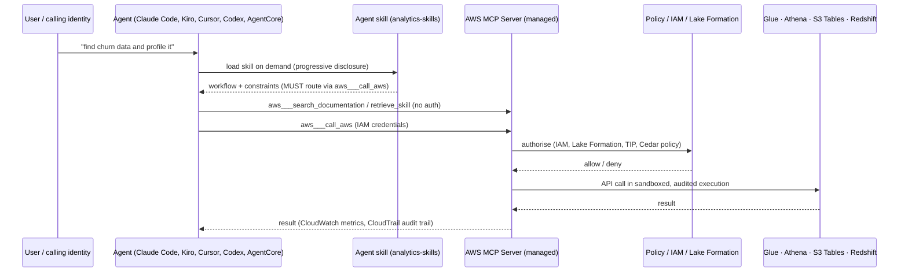
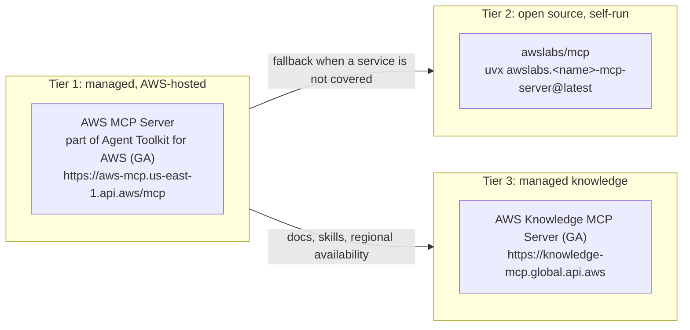

# AWS Analytics Delta: the data plane, and how agents now reach it (2026-08-26)

> **Paired document.** Adapted from `aws-data-engineering-landscape.md` in the sibling
> aws_data_engineering working directory, which holds the raw research. The two are not
> byte-identical by design. `sh tools/check_doc_sync.sh` reports when the source has moved
> and this has not.

**Date:** 2026-08-26
**Purpose:** first entry in a second watch feed, running alongside the Strands/AgentCore
ecosystem delta. That feed is SDK-shaped and says so: its 2026-07-18 edition parked
AgentCore Harness GA and AWS Context as "platform-level additions invisible at the SDK layer
of this report". This report covers the axis that one is built to miss, so an analytics wave
stops passing the repo unseen. Input to the L101+ decision on AgentCore Gateway, the managed
AWS MCP Server, and trajectory evals against a data agent.

**Sources to watch for the next edition:** AWS Glue, Amazon Athena, Amazon S3 Tables, AWS
Lake Formation, and the dated SageMaker Unified Studio release-notes page, which is granular
and machine-readable.

## Method and sources

Primary-source survey, 2026-08-25. Official AWS documentation, What's New posts and the
`awslabs` and `aws` GitHub repositories were fetched as raw bytes and read. Search results
were used only to locate candidate pages, never as evidence. Claims that only an extraction
pass supports are quarantined in [Unverified](#unverified-claims) rather than mixed in.

**Provenance rule used throughout this document.** Every claim carries one of two
markers:

- `[P]` **Primary bytes.** Fetched and read directly (raw HTML or raw markdown) in the
  session that produced this document. Quoted phrases are verbatim.
- `[X]` **Extraction only.** Came from a search-result summariser, not from raw bytes.
  Treat as a lead to verify, not as fact. See [Unverified](#unverified-claims).

Nothing here is asserted from model memory.

---

## 1. Layered view

```mermaid
flowchart TB
    subgraph AGENT["AGENT INTERFACE LAYER"]
        direction LR
        AT["Agent Toolkit for AWS (GA)<br/>AWS MCP Server (managed)<br/>agent skills · plugins · rules files"]
        OSS["awslabs/mcp (open source)<br/>~60 servers<br/>dataprocessing · s3-tables · redshift · ..."]
        KMCP["AWS Knowledge MCP Server (GA)<br/>knowledge-mcp.global.api.aws"]
        AC["Bedrock AgentCore (13 services)<br/>Harness · Runtime (MCP + A2A) · Gateway<br/>Identity · Policy · Registry · Evaluations"]
    end

    subgraph CTX["CONTEXT + GOVERNANCE LAYER"]
        direction LR
        AWSC["AWS Context (coming soon)<br/>knowledge graph + agentic search"]
        GBC["Glue Data Catalog<br/>business context + semantic search (preview)<br/>Search API · skill assets (preview)"]
        GOV["SageMaker Catalog · Lake Formation<br/>trusted identity propagation (TIP)"]
        ANN["S3 Annotations (GA)<br/>up to 1 GB context per object"]
    end

    subgraph ENG["ENGINE LAYER"]
        direction LR
        GLUE["AWS Glue 6.0<br/>Spark 4.1 · Python 3.13 · Iceberg v3"]
        ATH["Athena<br/>+ Athena for Apache Spark"]
        EMR["EMR (EC2 / Serverless)<br/>Spark Connect interactive"]
        RS["Redshift<br/>provisioned · serverless · managed workgroup"]
        STR["MSK · Data Firehose · Managed Flink"]
        SMUS["SageMaker Unified Studio<br/>(human surface, Data Agent embedded)"]
    end

    subgraph STORE["STORAGE + CATALOG LAYER"]
        direction LR
        S3T["S3 Tables (managed Apache Iceberg)"]
        S3V["S3 Vectors"]
        S3M["S3 Metadata (Iceberg tables)"]
        GDC["Glue Data Catalog<br/>+ federation to remote Iceberg catalogs"]
    end

    AGENT -->|"MCP tools · agentic search · A2A"| CTX
    CTX --> ENG
    ENG --> STORE
```



## 2. How an agent actually reaches data



---

## 3. Storage and catalog layer

| Component | State | Notes |
|---|---|---|
| S3 Tables | GA | Managed Apache Iceberg. The AWS analytics skills state their default target explicitly: "**Default to S3 Tables unless the environment says otherwise**" `[P]` |
| S3 Vectors | GA (Jan 2026 per extraction) | Native vector storage and query in S3 `[X]` |
| S3 Metadata | GA | Metadata tables stored as S3 Tables `[X]`; S3 Annotations flow into a managed Iceberg table here `[P]` |
| S3 Annotations | GA (announced 17 Jun 2026) | "Each object stored in S3 can have up to 1 GB of context." Mutable; moves with the object through copy and replication; deleted with the object. Discoverable "in natural language through the S3 Tables MCP server" `[P]` |
| Glue Data Catalog | GA | Single catalog surface; federation to remote Iceberg catalogs GA Nov 2025 `[X]` |

## 4. Engine layer

### AWS Glue 6.0 (GA 2026-08-21) `[P]`

Verbatim from the What's New post:

> AWS Glue 6.0 is now generally available, delivering a 30% price reduction and
> introducing full support for Apache Iceberg v3, newer versions of Apache Hudi and
> Delta Lake, and new capabilities to improve developer productivity. AWS Glue 6.0 also
> upgrades runtime to Apache Spark 4.1, Python 3.13, and Scala 2.13.

Iceberg v3 additions called out: VARIANT with automatic shredding, deletion vectors for
row-level updates, geometry and geography types, UNKNOWN type and DEFAULT column values.
Productivity additions: Spark Declarative Pipelines, Real-Time Mode streaming for
sub-second latency, Arrow-native Python UDFs. `[P]`

### Other engines

- **Athena for Apache Spark** backs the SageMaker Unified Studio serverless notebook,
  "automatically scaling from interactive queries to petabyte-scale processing" `[P]`
- **EMR on EC2** gained interactive Spark sessions via **Spark Connect** on 2026-08-04,
  usable from SMUS notebooks and from local Jupyter / VS Code `[P]`
- **Redshift**: provisioned, serverless, and Redshift Managed Workgroup (removes
  dedicated compute for querying lakehouse catalogs) `[X]`
- **Streaming**: MSK, Amazon Data Firehose, Managed Service for Apache Flink. 2026
  specifics not verified `[X]`

## 5. Context and governance layer

This is the layer that changed most, and the one that is least finished.

Announced at AWS Summit New York City, blog published 2026-06-17 `[P]`:

**AWS Context (coming soon).** Verbatim:

> a new service that automatically maps the relationships across your existing data into
> a knowledge graph and provides agentic search so AI agents in the organization can
> access governed data relationships, business rules, and domain knowledge at runtime.

Design commitments that matter architecturally, all verbatim `[P]`:

- Portability: "Key elements of the context layer are published to Amazon S3 in the
  Apache Iceberg format", queryable by "Amazon Athena, Amazon Redshift, Apache Spark, or
  any Iceberg-compatible engine".
- Access path: "Agents query it through agentic search APIs and MCP tools, whether
  they're built on Amazon Bedrock AgentCore, deployed on Amazon EKS, or running on
  MCP-compatible frameworks."
- Identity: "Each call is designed to inherit the calling user's IAM and Lake Formation
  permissions, so an agent can only see and traverse the relationships its identity is
  authorized to access."
- Provenance of the technology: it "extends the same knowledge graph technology that
  powers Amazon Quick", moving a personal graph to an organisational one.
- Integrations named: AWS Glue Data Catalog, Amazon SageMaker Unified Studio, AWS Lake
  Formation.

**Glue Data Catalog business context and semantic search (preview).** Enriches tables,
views and columns (including S3 Tables backed ones) with business descriptions, glossary
terms and custom metadata, indexed alongside technical metadata, reachable through a new
**Glue Search API**. `[P]`

**Skill assets in Glue Data Catalog (preview).** Verbatim: "a new asset type that
references URIs to files (such as AI skills, guide markdown files, and team runbooks)
hosted in any location including S3, git repositories, and wikis". Purpose: give agents
retrievable instructions on *how* to use a dataset (grain and scope, query patterns, join
keys, required filters) rather than re-teaching it per prompt. `[P]`

**Trusted identity propagation (2026-08-19).** SMUS notebooks propagate the individual
user identity to Athena, Redshift and EMR Serverless via IAM Identity Center, enabling
per-user fine-grained access instead of a shared role. Enabled by setting
`enableTrustedIdentityPropagationPermissions` to `True` in the project profile Tooling
blueprint. Known gap, verbatim: "AWS Glue and Amazon EMR on EC2 do not support TIP from
notebooks and continue to use compatibility permission mode for data access." `[P]`

## 6. Agent interface layer

### 6.1 Three MCP tiers, not interchangeable



#### Tier 1: Agent Toolkit for AWS (GA)

The `aws-mcp` documentation path now redirects to `agent-toolkit`; the product was
announced in May 2026. `[P]`

Four components, verbatim from the user guide `[P]`:

1. **AWS MCP Server**: "A managed server that gives agents access to AWS through the
   Model Context Protocol (MCP)." Documentation search needs no authentication; "To
   execute AWS API calls, run Python scripts in a sandboxed environment, or follow
   curated skills, agents authenticate through your existing IAM credentials." Single
   endpoint, CloudWatch metrics, IAM access controls, CloudTrail audit.
2. **Agent skills**: loaded on demand so they "do not consume unnecessary context".
3. **Plugins**: single-install bundles of MCP config plus curated skills, for Claude Code
   and Codex. Kiro connects directly and needs no plugin.
4. **Rules files**: project-level guardrails.

Relevant plugin `[P]`:

```
/plugin install aws-data-analytics@claude-plugins-official
```

described as covering "data lake, analytics, and ETL workflows with S3 Tables, AWS Glue,
and Athena". Siblings: `aws-core`, `aws-agents`, `aws-agents-for-devsecops`.

Direct MCP wiring (from the repo README, version pinning is their recommendation) `[P]`:

```json
{
  "mcpServers": {
    "aws": {
      "command": "uvx",
      "args": [
        "mcp-proxy-for-aws@1.6.4",
        "https://aws-mcp.us-east-1.api.aws/mcp",
        "--metadata",
        "AWS_REGION=us-west-2"
      ]
    }
  }
}
```

#### Tier 2: awslabs/mcp, data-relevant servers `[P]`

| Server | Coverage |
|---|---|
| `aws-dataprocessing-mcp-server` | Glue Data Catalog, crawlers, connections and entity preview, interactive sessions, workflows and triggers, ETL jobs; EMR-EC2 clusters, instance fleets, steps, security config; Athena query execution, named queries, data catalogs (LAMBDA / GLUE / HIVE / FEDERATED), workgroups |
| `s3-tables-mcp-server` | Table buckets, namespaces, tables, maintenance config, policies, metadata, read-only SQL, CSV to table |
| `redshift-mcp-server` | Cluster and serverless workgroup discovery, database / schema / table / column metadata, read-only query execution |
| Others | `dynamodb`, `postgres` (Aurora), `mysql` (Aurora), `aurora-dsql`, `documentdb`, `neptune`, `keyspaces`, `timestream-for-influxdb`, `oracle`, `mssql`, `elasticache`, `valkey`, `memcached`, `roda` (Registry of Open Data) |
| External | Amazon OpenSearch MCP server lives in `opensearch-project/opensearch-mcp-server-py`, not in `awslabs/mcp` |

#### Tier 3: AWS Knowledge MCP Server (GA) `[P]`

Endpoint `https://knowledge-mcp.global.api.aws`, Streamable HTTP. Five tools:
`search_documentation`, `read_documentation`, `list_regions`,
`get_regional_availability`, `retrieve_skill`.

### 6.2 Default-deny posture in the AWS MCP servers

Worth mirroring in anything built here, not just consuming. All verbatim `[P]`:

- Data Processing server: "The DataProcessing MCP Server can only update or delete
  resources that were originally created through it. Resources created by other means
  cannot be modified or deleted using the DataProcessing MCP Server."
- Data Processing server: write and sensitive-data access are behind explicit
  `--allow-write` and `--allow-sensitive-data-access` flags, with a warning that the
  combination "grants significant privileges to the MCP server".
- S3 Tables server: header reads "YOU ARE RESPONSIBLE FOR YOUR AGENTS"; read-only by
  default; `--allow-write` enables create and append only; "For write operations, only
  **appending new data** (inserts) is supported; updates and deletes via SQL are not
  available."
- Redshift server: "Run SQL queries in a read-only mode (single statement; writes
  rejected)".

### 6.3 Agent skills shipped by AWS for data work `[P]`

Repo `aws/agent-toolkit-for-aws`, path `skills/specialized-skills/`:

- `analytics-skills/`: `querying-data-lake`, `ingesting-into-data-lake`,
  `exploring-data-catalog`, `finding-data-lake-assets`, `connecting-to-data-source`,
  `creating-data-lake-table` (referenced by siblings), `redshift-guide`,
  `migrating-to-amazon-redshift`, `managing-amazon-msk`, `migrate-to-msk`,
  `developing-applications-on-managed-service-for-apache-flink`,
  `amazon-opensearch-service`, `aws-cleanrooms`
- `system-table-skills/`: `querying-aws-cloudwatch`, `querying-aws-redshift`,
  `querying-aws-s3`, `querying-aws-sagemaker-catalog`
- `database-skills/`, `messaging-and-streaming-skills/`, `storage-skills/`,
  `migration-and-modernization-skills/`, and others

Two conventions in the skill bodies worth copying `[P]`:

1. Execution routing is mandated, not suggested: "You MUST verify AWS MCP server tools
   are available (`aws___call_aws`) and run queries through them when present; fall back
   to AWS CLI only if the MCP server is unavailable" and "You MUST NOT fall back to shell
   or Bash for query execution: results must be captured via the MCP tool or `aws athena`
   CLI so output location and cost are tracked."
2. Skills declare negative routing in their own descriptions ("Do NOT use for ... use
   `finding-data-lake-assets`"), which is what keeps a large skill set resolvable.

### 6.4 Bedrock AgentCore

Thirteen modular services, verbatim list from the developer guide `[P]`: Harness,
Runtime, Memory, Gateway, Identity, Code Interpreter, Browser, Observability, Payments,
Evaluations, Optimization, Policy, Registry.

The four that carry weight for data engineering `[P]`:

| Service | Why it matters here |
|---|---|
| **Gateway** | "A secure way to convert your APIs, Lambda functions, and existing services into Model Context Protocol (MCP)-compatible tools and also connect to pre-existing MCP servers". This is how an internal data API becomes an agent tool without writing an MCP server. |
| **Policy** | "deterministic control to ensure agents operate within defined boundaries and business rules". Rules in natural language or Cedar. "Integrates with AgentCore Gateway, to intercept every tool call before execution." |
| **Registry** | "A centralized catalog for discovering and managing agents, MCP servers, tools, skills and custom resources across your organization", with publish / review / approve workflow and hybrid semantic plus keyword search. |
| **Runtime** | Supports "popular protocols like MCP and A2A", and frameworks CrewAI, LangGraph, LlamaIndex, Google ADK, OpenAI Agents SDK, Strands Agents. |

**Harness** is the newer managed agent loop: model, system prompt and tools inline in a
single API call, each session in an isolated microVM with filesystem and shell access,
explicitly aimed at "code generation, data analysis, and deep research" `[P]`. The
context blog adds: "Agents built with AgentCore harness can access all AWS skills in the
AWS Agent Toolkit with one line of code." `[P]`

**A2A.** AgentCore Runtime lists A2A as a supported protocol `[P]`. Implementation
details (server support landed Nov 2025, JSON-RPC 2.0 over HTTP, agent cards for
discovery, stateless streamable HTTP on port 9000, SigV4 / OAuth 2.0) are `[X]` and need
verification against the AgentCore developer guide pages `runtime-a2a.html` and
`runtime-a2a-protocol-contract.html`.

## 7. SageMaker Unified Studio: the human surface going agentic

Dated entries from the official release notes page, all `[P]`:

| Date | Change |
|---|---|
| 2025-09-08 | Amazon Q Developer in SMUS becomes project-aware "By integrating with Model Context Protocol (MCP) servers ... aware of your SageMaker Unified Studio project resources, including data, compute, and code" |
| 2025-11-21 | Serverless notebooks with a built-in AI agent, backed by Athena for Apache Spark |
| 2025-11-21 | **SageMaker Data Agent** launched: natural language objective in, execution plan plus SQL and Python out, aware of notebook context, data sources, schemas, catalog |
| 2026-03-30 | Data Agent reaches the Query Editor: NL to SQL for Redshift and Athena, plan shown for review before generation, "Fix with AI" on failure |
| 2026-04-01 | Geo-specific inference (JP-CRIS, AU-CRIS) for data residency |
| 2026-04-03 | Charting, Snowflake SQL analytics, materialized view recommendation and creation |
| 2026-04 / 2026-05 | Serverless notebooks and Data Agent extended to IAM Identity Center domains |
| 2026-06 | Data Agent integrates SageMaker Catalog business context: "searches glossary terms, custom metadata forms, asset summaries, and README content"; checks subscription status and provides access request links |
| 2026-06 | Notebook scheduling with multi-notebook orchestration; Data Agent does AI-assisted root cause analysis on failed runs |
| 2026-08-04 | EMR on EC2 interactive sessions via Spark Connect |
| 2026-08-11 | One-click entry to SMUS from Glue console (now also from S3 Tables, Athena, EMR, Redshift) |
| 2026-08-18 | Data profiling and anomaly detection powered by Glue Data Quality, for catalog tables and in-flight Visual ETL |
| 2026-08-19 | Trusted identity propagation from notebooks (see section 5) |

Data source breadth added through 2026: Teradata Vantage (2026-07-31), Amazon OpenSearch
(2026-07-21), Snowflake, BigQuery `[P]`.

---

## 8. Implications for a greenfield build

1. **Target S3 Tables by default.** This is not a preference read from blogs; it is the
   stated default in AWS's own ingest skill, with standard Iceberg on a general purpose
   bucket as the documented fallback where S3 Tables is not adopted. `[P]`
2. **Use the managed AWS MCP Server plus the `aws-data-analytics` plugin as the primary
   agent path.** Reach for `awslabs/mcp` servers only where the managed server does not
   cover a service, or for local development. Reason: single endpoint, IAM auth,
   CloudTrail audit, CloudWatch metrics. `[P]`
3. **Pin MCP versions.** AWS's own README recommends pinning `mcp-proxy-for-aws@<version>`
   "to ensure reproducible behavior and protect against supply chain risks". `[P]`
4. **Design the context layer now, but do not wait on AWS Context.** It is "coming soon"
   and Glue business context plus skill assets are preview. The buildable version today
   is: business metadata in SageMaker Catalog or Glue, own runbooks as skill assets
   pointing at git URIs, S3 Annotations for object-level context. All three are already
   Iceberg-queryable or URI-referenced, so the migration path to AWS Context is additive
   rather than a rewrite. `[P]`
5. **Make identity the access path, not a shared role.** Turn on trusted identity
   propagation for Athena, Redshift and EMR Serverless from notebooks; know that Glue and
   EMR on EC2 do not support it from notebooks yet and will fall back to compatibility
   permission mode. `[P]`
6. **Copy the default-deny tool posture.** Read-only default, explicit write flag,
   creator-only mutation, single-statement query enforcement. That is the shape of every
   AWS-authored data MCP server. `[P]`
7. **Encode procedure as skills, not prompts.** AWS's skills carry negative routing in
   the description, a MUST-level execution channel, and progressive disclosure via a
   `references/` directory. Skill assets in Glue make the same pattern catalog-native.
   `[P]`

---

## Unverified claims

Held from search-result extraction only. Verify against raw bytes before relying on any
of these.

| Claim | Needs |
|---|---|
| S3 Vectors GA date, 2 billion vectors per index, up to 90% TCO reduction | S3 Vectors product page / What's New post |
| Amazon Quick Suite naming chain and connector counts | Amazon Quick product page |
| Glue catalog federation to remote Iceberg catalogs GA Nov 2025 | `whats-new/2025/11/aws-glue-catalog-federation-remote-apache-iceberg-catalogs` |
| Zero-ETL latency figures (DynamoDB 15 min, SaaS sources 1 hr) | Redshift and Glue zero-ETL docs |
| MSK / Data Firehose 2026 feature changes | Firehose and MSK What's New feeds |
| A2A implementation contract (port 9000, JSON-RPC 2.0, agent cards, SigV4 / OAuth 2.0) | `bedrock-agentcore/latest/devguide/runtime-a2a-protocol-contract.html` |
| Redshift Managed Workgroup details | SMUS release notes / Redshift docs |
| SMUS "19 new operators" and "20+ new features in 2026" | SMUS release notes (page was read but these specific counts were not located in it) |

---

## Sources

Primary `[P]` sources, all fetched 2026-08-25:

1. [Context intelligence for your data and AI agents at scale](https://aws.amazon.com/blogs/machine-learning/context-intelligence-for-your-data-and-ai-agents-at-scale/) (published 2026-06-17)
2. [What is the Agent Toolkit for AWS?](https://docs.aws.amazon.com/agent-toolkit/latest/userguide/what-is-agent-toolkit.html)
3. [AWS MCP Server](https://docs.aws.amazon.com/agent-toolkit/latest/userguide/mcp-server.html)
4. [aws/agent-toolkit-for-aws README](https://github.com/aws/agent-toolkit-for-aws)
5. [Agent Toolkit analytics skills](https://github.com/aws/agent-toolkit-for-aws/tree/main/skills/specialized-skills/analytics-skills)
6. [querying-data-lake SKILL.md](https://github.com/aws/agent-toolkit-for-aws/blob/main/skills/specialized-skills/analytics-skills/querying-data-lake/SKILL.md)
7. [ingesting-into-data-lake SKILL.md](https://github.com/aws/agent-toolkit-for-aws/blob/main/skills/specialized-skills/analytics-skills/ingesting-into-data-lake/SKILL.md)
8. [exploring-data-catalog SKILL.md](https://github.com/aws/agent-toolkit-for-aws/blob/main/skills/specialized-skills/analytics-skills/exploring-data-catalog/SKILL.md)
9. [awslabs/mcp README](https://github.com/awslabs/mcp)
10. [AWS Data Processing MCP Server README](https://github.com/awslabs/mcp/tree/main/src/aws-dataprocessing-mcp-server)
11. [AWS S3 Tables MCP Server README](https://github.com/awslabs/mcp/tree/main/src/s3-tables-mcp-server)
12. [Amazon Redshift MCP Server README](https://github.com/awslabs/mcp/tree/main/src/redshift-mcp-server)
13. [AWS Knowledge MCP Server README](https://github.com/awslabs/mcp/tree/main/src/aws-knowledge-mcp-server)
14. [Release notes for Amazon SageMaker Unified Studio](https://docs.aws.amazon.com/sagemaker-unified-studio/latest/userguide/release-notes.html)
15. [AWS Glue 6.0 delivers 30% price reduction and Iceberg v3 support](https://aws.amazon.com/about-aws/whats-new/2026/08/aws-glue-6-0-price-reduction-iceberg-v3/) (posted 2026-08-21)
16. [What is Amazon Bedrock AgentCore?](https://docs.aws.amazon.com/bedrock-agentcore/latest/devguide/what-is-bedrock-agentcore.html)
