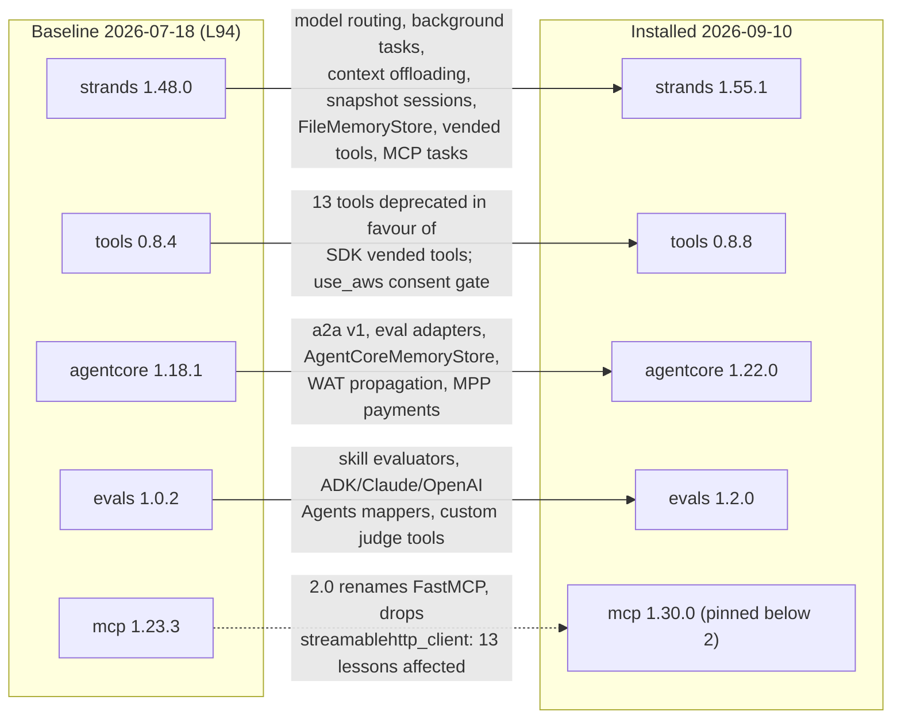

# Strands Ecosystem Delta: v1.48 to v1.55.1 (2026-07-17 to 2026-09-10)

**Date:** 2026-09-10
**Purpose:** record of everything that changed in the Strands/AgentCore ecosystem between this
repo's last validated baseline (L94 to L100 on strands 1.48.0, 2026-07-19) and today, and of the
environment upgrade that put the repo on the new stack. Successor to
[`2026-07-18_strands-ecosystem-delta-v142-to-v148.md`](2026-07-18_strands-ecosystem-delta-v142-to-v148.md).

## Method and sources

Four parallel read-only explorations plus one hands-on upgrade, consolidated here:

1. **Core SDK**: the existing clone at `~/Code/strands-sdk-python` fetched and fast-forwarded
   from `41f9f59b` (2026-07-17) to `9663bcfa5` (2026-09-10). Its origin now resolves to
   `strands-agents/harness-sdk.git`. 175 commits touching `strands-py/` between tags
   `python/v1.48.0` and `python/v1.55.1` were inventoried (section 1).
2. **AgentCore SDK**: clone at `~/Code/bedrock-agentcore-sdk-python` fast-forwarded from
   `a4bc13f` (v1.18.1) to `3c9f15e` (2026-09-09); tags v1.19.0 to v1.22.0 read commit by commit,
   release bodies pulled from the GitHub API (section 3).
3. **Ecosystem packages**: GitHub release bodies and PyPI `requires_dist` for tools, evals,
   ai-functions, sops, ag-ui-strands, shell (clone `~/Code/strands-shell-src` fast-forwarded to
   `943e4dc`), and the two transitive majors, mcp 2.x and a2a-sdk 1.x (sections 4 and 5).
4. **External coverage**: AWS What's New, AWS blogs, the AgentCore release-notes page, and the
   Strands blog, each page fetched and quoted (section 7). Fetch output is an extraction, so each
   quote there is labelled as such.
5. **Upgrade**: `uv lock --upgrade` and `uv sync` in this repo, then pytest, both gates, a
   runtime surface probe of the new APIs, and six live lessons (section 6).

PyPI versions verified 2026-09-10 via `pypi.org/pypi/<pkg>/json`.

## Baseline vs current

| Package | Repo baseline (L94, 2026-07-18) | Installed now | PyPI latest | Note |
|---|---|---|---|---|
| strands-agents | 1.48.0 | **1.55.1** | 1.55.1 | 8 releases, no 1.49 tag |
| strands-agents-tools | 0.8.4 | **0.8.8** | 0.8.8 | 13 tools deprecated |
| strands-agents-evals | 1.0.2 | **1.2.0** | 1.2.0 | skill evaluators, more mappers |
| bedrock-agentcore | 1.18.1 | **1.22.0** | 1.22.0 | 4 minors |
| bedrock-agentcore-starter-toolkit | 0.3.9 | **0.3.12** | 0.3.12 | fixes only |
| ag-ui-strands | 0.1.1 | **0.3.0** | 0.3.0 | interrupt protocol |
| strands-ai-functions | 0.1.0 | **0.4.0** | 0.4.0 | 0.3.0 was a breaking rewrite |
| strands-agents-sops | 1.1.2 | **1.1.3** | 1.1.3 | mcp 2 compat fix |
| strands-shell | 0.3.1 | **0.3.3** | 0.3.3 | dependency bumps only |
| mcp | 1.23.3 | **1.30.0** (pinned `<2`) | 2.2.0 | see section 5 |
| a2a-sdk | 0.3.25 | **0.3.26** | 1.1.2 | capped `<0.4` by strands |
| boto3 | 1.43.51 | **1.43.92** | 1.43.92 | |



## The shape of the change

Three things moved at once.

- **The SDK grew a second layer of first-party runtime pieces.** 1.50 to 1.55 added model routing
  (`ModelRouter` accepted by `Agent(model=)`), background tool execution, a context manager with
  offloading strategies, a snapshot session manager, a file memory store, and six vended tools
  (`sleep`, `stop`, `http_request`, `web_fetch`, `notebook`, `bash`). The tools package responded by
  deprecating 13 of its own tools with pointers at the vended equivalents.
- **AgentCore shipped the pieces this repo studied as gaps.** Runtime instances (EC2-backed, up to
  14-day sessions), temporal policies and Dogwood in AgentCore Policy, payments GA with MPP, Agent
  Registry GA, four Memory features (direct ingest, JSON payloads, flexible namespaces, FGAC), and
  an Identity consent portal.
- **Two transitive majors landed under the SDK.** mcp 2.0 (2026-07-28) renames `FastMCP` to
  `MCPServer` and removes `streamablehttp_client` and the experimental tasks module, which 13
  lesson files import. a2a-sdk 1.0 rewrote its types onto protobuf; strands 1.55.1 still caps it
  at `<0.4`, so that one cannot reach this repo yet.

## 1. Core Python SDK: 1.48.0 to 1.55.1

Clone `~/Code/strands-sdk-python`, HEAD `9663bcfa5`. 175 commits touch `strands-py/` between the
tags; `git diff python/v1.48.0..python/v1.55.1 --stat -- strands-py/src` ends
`173 files changed, 18359 insertions(+), 2507 deletions(-)`. Tags are lightweight and the version
is tag-derived (`pyproject.toml:8` `dynamic = ["version"]`). Per-release changelogs live at
`site/src/content/changelog/harness/python-v<ver>.md` (frontmatter only, bot-synced). Citations
below are relative to `strands-py/src/strands/` at `python/v1.55.1`.

### Why there is no 1.49

No `python/v1.49.x` tag exists locally or on GitHub (`gh api .../git/refs/tags/python/v1.49.0`
returns 404) and PyPI has no 1.49.0. The release workflow takes a typed version
(`release-python.yml:16` "Explicit version, e.g. 1.4.0"), and on 2026-07-24 the run at 13:15 UTC
published 1.50.0 straight after 1.48.0. The same day PR #3473 `ci(release): enforce
single-increment versions and verify publish on the registry` landed; its body reads "The scan
previously rejected only non-monotonic versions, so a typo like `1.48.0` -> `1.84.0` sailed
through to the approver." At 1.55.1 the guard is `release-python.yml:119`. Whether the skip was a
typo or deliberate is not stated anywhere.

### Release by release (strands-py commits, subjects verbatim)

| Tag | Date | What it carries |
|---|---|---|
| 1.50.0 | 2026-07-24 | `feat(vended-tools): add http_request to strands-py (#3395)`, `add stop tool (#3397)`, `add sleep tool (#3393)`; `feat(py): configurable retry exceptions (#3340)`; `feat(middleware): add ExecuteToolStage with middleware-initiated interrupts (#3233)`; `chore: merge strands-agents/mcp-server into monorepo (#3300)` |
| 1.50.1 | 2026-07-24 | `feat(model-routing): thread per-call model through InvokeModelStage (#3434)`; `refactor(vended-tools): move stop tool to experimental (#3465)` |
| 1.50.2 | 2026-07-27 | `feat(python): add per-call MCP tool cancellation (#3402)`; `refactor(http_request): remove security features, accept httpx.AsyncClient (#3491)` |
| 1.51.0 | 2026-08-07 | **breaking** `refactor(vended-tools)!: rename sandbox-routed bash tool to shell (#3574)`; `feat: add snapshot session manager to python (#3283)`; `feat(python): add BeforeToolsEvent and AfterToolsEvent batch hooks (#3508)`; `feat(a2a): support the interrupt round trip over A2A (#3486)`; `feat(hitl-py): add classifier option for LLM-driven risk classification (#3575)`; `feat: add context window limits for Claude 5 and GPT-5.6 families (#3629)`; `feat: support Tool Choice for Gemini in Python (#3551)`; `feat(model): add estimateUtilization method to Model base class (#3641)` |
| 1.52.0 | 2026-08-12 | `feat(model-routing): add ModelRouter and accept it via Agent(model=) (#3474)`; `feat(storage-py): add top level storage (#3743)`; `feat(middleware): add AgentStreamStage with middleware-initiated interrupts (#3594)` |
| 1.53.0 | 2026-08-20 | **breaking** `fix(bedrock)!: cache system prompt in auto mode (#3681)`; `feat(anthropic): enable prompt caching via cache_config and cache_tools (#3571)`; `feat: add injected content behind cache points (#3704)`; `feat(mcp): surface tool annotations in ToolSpec (#3528)`; `feat(mcp): add client OAuth authentication for streamable HTTP (#3554)`; `feat(py): add agent-as-tool delegation (#3346)`; `feat(python): add audio content blocks (#3862)`; `feat(memory): support min/max score filtering in Bedrock knowledge base store (#3726)` |
| 1.54.0 | 2026-08-27 | `feat(memory-py): add FileMemoryStore (#3925)`; `feat(routing): add configurable classifier strategy (#3846)`; `feat(python): add session_id property to Agent (#4007)`; `feat(python): inject an external cancellation signal into agent invocations (#3999)`; `feat(models): add cache_key to CacheConfig for key-routed cache providers (#3949)`; `fix: count cached tokens in context-size and compaction baseline (#3886)` |
| 1.55.0 | 2026-09-08 | MCP 2.x: `feat: mcp v2 compatible changes under a flag (#3708)`, `feat(mcp): added server/discover for SEP-2575 (#3821)`, `feat(mcp): added call_tool support for 2.x (#4090)`, `feat(mcp-py): added MRTR input-required support for 2.x (#4094)`, `feat(mcp/py): support SEP-2663 tasks (#4125)`, `feat(mcp-py): relax mcp version to <2.2 (#4151)`, `fix(mcp-py): added httpx2 adapter (#4183)`; `feat(py): add web_fetch vended tool (#4001)`; `feat(context-py): port offloading stratgies (#4146)`, `port stash integration (#4187)`, `feat: export context manager types as experimental (#4231)`; `feat(agent): add LocalAgent protocol (#4091)`; `feat(python): add internal in-process task engine / manager (#4115)`; `feat(bedrock): support API key authentication (#3601)`; `feat(models): add tools_ttl to CacheConfig and deprecate cache_tools (#3985)`; `chore(python): deprecate LlamaAPI model provider (#4011)`; cache_config on Mistral, llama.cpp, Ollama, Writer, SageMaker |
| 1.55.1 | 2026-09-09 | `feat(vended-tools): port notebook tool to Python (#4132)`; `feat(python): add backgroundTasks to Agent (#4226)` |

### Fate of the features this repo tracked at 1.48

| Tracked (L94 to L100) | At 1.55.1 |
|---|---|
| Interventions (L96) | Unchanged surface; HITL intervention gains `classifier: bool \| LLMClassifierConfig \| HumanInTheLoopClassifier \| None` (`vended_interventions/hitl/hitl.py:128`) |
| Checkpoint runtime (L95) | Unchanged; new sibling `SnapshotSessionManager` (`session/snapshot_session_manager.py:183`) with `save_latest_on: Literal["message", "invocation", "trigger"]` |
| Memory (L97, L97b) | `MemoryManager` unchanged; `FileMemoryStore` (`vended_memory_stores/file_memory_store/store.py:82`) and KB `min_score`/`max_score` (`bedrock_knowledge_base/types.py:145`) added |
| Sandbox (L98) | Vended `bash` renamed `shell` (`vended_tools/shell/shell.py:29` `def make_shell(sandbox: Sandbox \| None = None, ...)`); `bash` kept as a deprecated alias that warns "will be removed in v2.0.0" |
| Context management (L100) | Rebuilt: `ContextManager(Plugin)` (`_context_manager/context_manager.py:33`) with `Drop`, `Summarize`, `Truncate`, `EmergencyTruncate` offload strategies and a `Stash`; public surface exported as `strands.experimental.context_manager` (`__all__`: `ContextManager, ContextState, ContextStrategy, Offload, OffloadConditions, OffloadTarget, StashConfig, SummarizeConfig, TruncateConfig`); `Agent(context_manager=...)` at `agent/agent.py:232` |
| Storage protocol (L94 probe) | Same three impls; new `storage/search/keyword.py:44` `class KeywordSearchStrategy` |
| Prompt caching (L62) | `CacheConfig` (`models/model.py:135`) fields `strategy`, `ttl`, `system_prompt_ttl: bool \| str = True`, `cache_key`, `tools_ttl`; `cache_tools` deprecated; **system prompt is now cached by default** under an anthropic-strategy model (#3681 body: "the system prompt is now cached **by default**") |
| Token counting (L61) | Cached tokens now count toward context size (#3886); Gemini tool-use tokens counted as input, thinking as output (#3892) |

### New entry points for study

- **Model routing.** `models/routing/router.py:130` `class ModelRouter(Plugin)`, `__init__(models, *, strategy=None, max_switches=None)`; `ClassifierStrategy(model, *, system_prompt, timeout=30.0, ...)` (`classifier_strategy.py:102`), `FallbackStrategy`, `RoutingStrategy(Protocol)`. Design doc `team/designs/0016-model-routing.md`.
- **Background tasks.** `agent/agent.py:245` `background_tasks: bool | BackgroundTasksConfig | None`, doc "let the model run tools in the background and receive their results when they finish"; engine `background_tasks/in_process/_engine.py:36`.
- **Cancellation.** `agent/agent.py:699` `def cancel(self)`, `:737` `cancel_signal` property, invoke methods accept `cancel_signal: threading.Event | None` ("Caller-owned event that cancels this invocation"); `MCPClient.call_tool_sync(..., cancel_signal=...)`.
- **Agent delegation.** `as_tool(delegate=True)` (`agent/agent.py:1133`), plugin `agent/_agent_delegation.py:73` `class AgentDelegation(Plugin)`.
- **Retry policy.** `event_loop/_retry.py:21` `class ModelRetryStrategy(HookProvider)`, `max_attempts=6, initial_delay=4, max_delay=240`, "Subclass and override `is_retryable`".
- **Middleware.** `_middleware/README.md:7` "All three stages are implemented: `InvokeModelStage`, `ExecuteToolStage`, and `AgentStreamStage`." `AgentStreamStage` is marked `@internal`.
- **MCP client.** `MCPClient.__init__` gains `auth: MCPClientCredentials`, `auth_provider: httpx.Auth`, `tasks_config: TasksConfig`; `load_servers(config, *, continue_on_error=False, prefix_with_server_name=False)` (`mcp_client.py:229`); `ToolSpec.annotations` carries MCP `readOnlyHint`/`destructiveHint` (`types/tools.py:56`). `_compat.py:54` `MCP_V2: bool = hasattr(ClientSession, "discover")`.
- **Vended tools.** `sleep`, `http_request`, `web_fetch` (`make_web_fetch(mode: Literal["markdown", "agentic"] = "agentic")`, needs the `web-fetch` extra), `notebook`, `shell`; `stop` in `experimental/tools/stop/stop.py:71`.
- **Audio.** `types/media.py:70` `AudioSource`, `:84` `AudioContent`; `ContentBlock.audio`.
- **Bidi (experimental).** Providers renamed to `BedrockNovaSonicModel`, `GoogleGeminiLiveModel`, `OpenAIRealtimeModel`; `BidiModel(Model)`; `restart()`; the mypy/ruff/pytest excludes for bidi were removed from `pyproject.toml`.
- **Skills.** `vended_plugins/skills/agent_skills.py:74` `class AgentSkills(Plugin)`, `skill.py:208` `class Skill`. Present since 1.48 (`1b8cd9f 2026-06-16`); the only change in window is the HEAD fix `fix(skills-py): avoid leaking YAML parse error (#4192)`. Not a package.

### Breaking changes and deprecations

- B1 `bash` to `shell` (1.51.0, #3574). PR body: "The sandbox-routed vended tool is named `bash`, but it never runs bash. It delegates to `Sandbox.execute()`." Shim `vended_tools/_bash.py:35` `@deprecated("make_bash is deprecated and will be removed in v2.0.0. Use make_shell instead.")`. L98 imports should move.
- B2 System prompt auto-cached (1.53.0, #3681). `models/model.py:163` `system_prompt_ttl: bool | str = True`; pass `False` to disable. Changes the cost profile L62 measured.
- D1 `cache_tools` deprecated for `CacheConfig(tools_ttl=...)` (1.55.0, #3985), `DeprecationWarning`.
- D2 `LlamaAPIModel` "deprecated and will be removed in v2.0.0. The underlying Llama API service has been deprecated by Meta." (`models/llamaapi.py:33`).
- D3 Legacy context-offloader storage classes deprecated for the unified `Storage` backends (1.50.2, #3476).
- D4 mcp 1.x `cursor` keyword on session list methods deprecated (`_compat.py`).

An exhaustive grep of added source lines for `DeprecationWarning|deprecated|BREAKING|removed in`
gave 46 hits, all within B1 and D1 to D4.

### Dependency floors (`strands-py/pyproject.toml`, 1.48.0 to 1.55.1)

| Dep | 1.48.0 | 1.55.1 |
|---|---|---|
| mcp | `"mcp>=1.23.0,<2.0.0"` | `"mcp>=1.23.0,<2.2"` |
| httpx | extra only | `"httpx>=0.28.1,<1.0.0"` in core |
| a2a-sdk | `>=0.3.0,<0.4.0` | unchanged |
| boto3 / botocore / opentelemetry | `>=1.26.0` / `>=1.29.0` / `>=1.30.0` | unchanged |
| gemini extra | `google-genai>=1.32.0,<3.0.0` | `>=1.67.0,<3.0.0` |
| litellm extra | `<=1.91.1` | `<=1.96.0` |
| cedar extra | `cedarpy==4.8.6` | `cedarpy==4.8.7` |
| new extras | | `web-fetch`, `bidi-google`, `bidi-aec`, `bidi-pyaudio` |

The SDK's own test matrix keeps an mcp 1.x lane: `[tool.hatch.envs.hatch-test.overrides]`
`env.STRANDS_TEST_MCP_V1.dependencies = [{ value = "mcp>=1.23.0,<2.0.0", if = ["1"] }]`.

### Monorepo meta

- The `harness-sdk` rename predates this window: first commit `ff37eb0a0 2026-06-05 chore: update repository references to harness-sdk (#2618)`.
- `strands-mcp/` (package `strands-agents-mcp-server`, tags `mcp/v0.2.8`, `mcp/v0.2.9`) merged in on 2026-07-21; `strandly/` removed 2026-08-14 (#3806).
- New design docs: `team/designs/0015-bidi-webrtc-design.md`, `0015-context-manager.md`, `0016-model-routing.md`, `0017-file-memory-store.md`, `0017-shared-agent-model-types.md`; new `team/COMPLEXITY.md`.
- Commit volume 1.48.0 to HEAD: 461, of which strands-py 184, site 184, strands-ts 100.
- TypeScript 1.11.0 to 1.17.0 tracks the same features (ToolExecutor hierarchy, model routing, FileMemoryStore, backgroundTasks, context manager) and 1.17.0 is breaking: `feat!: require Node.js 22+, drop Node 20 support (#4145)`.

## 2. What the upgrade did to this repo

Commands run, in order, in `~/Code/aws_agent_1`:

```
uv lock --upgrade          # 271 packages resolved; strands 1.48.0 -> 1.55.1 and friends
uv sync
uv run pytest -q           # 221 passed in 25.65s
uv run no-sim-check $(git ls-files '*.py')            # scanned 303 file(s), 0 simulation smell(s)
uv run check-no-aws-ids $(git ls-files '*.py' '*.md') # scanned 529 file(s), clean
```

The first lock resolved mcp to 2.1.1 (strands 1.55.1 declares `mcp>=1.23.0,<2.2`). A named probe,
`_sandbox/probe_upgrade_2026-09-10_mcp_symbols.py`, then showed three lesson imports gone:

```
MISS mcp.client.streamable_http.streamablehttp_client
FAIL import mcp.server.fastmcp: ModuleNotFoundError("No module named 'mcp.server.fastmcp'.
     This is mcp 2.x, where FastMCP was renamed to MCPServer ...")
MISS mcp.server.experimental
```

`git grep` finds those names in 13 tracked lesson files (`04_production/mcp_integration.py`,
`06_memory/{benchmark_memory_systems,benchmark_query,benchmark_store,longterm_memory,unified_memory}.py`,
`09_cutting_edge/research_agent.py`, `10_production/l27agentcore/src/mcp_client/client.py`,
`11_2026_updates/mcp_elicitation.py`, `11_platform/sdk_advances.py`,
`13_quality/{_mcp_dedicated_server,_mcp_naive_server,secure_mcp}.py`). Decision: pin
`mcp>=1.23.3,<2` in `pyproject.toml` with a comment naming the three symbols, re-lock (mcp
1.30.0), and record the migration as follow-on work rather than rewrite 13 lessons inside an
upgrade. bedrock-agentcore 1.22.0 makes the same choice for its own `strands-agents` extra
(`"mcp>=1.23.0,<2.0.0"`), and strands 1.55.1 carries an explicit `tools/mcp/_compat.py`:
"Compatibility layer over the `mcp` 1.x and 2.x lines."

Cost of the pin, quoted from `strands/tools/mcp/mcp_tasks.py` at 1.55.1: "The finalized SEP-2663
models require mcp 2.x ... On the runtime pin `mcp<2.0.0` they cannot round-trip server JSON; the
corresponding client methods raise `RuntimeError`." So MCP task-augmented tool calls (new in 1.55)
are not usable here until the 13 files migrate.

`pyproject.toml` floors were raised to the resolved versions (strands 1.55.1, tools 0.8.8, evals
1.2.0, agentcore 1.22.0, starter toolkit 0.3.12, ag-ui-strands 0.3.0, shell 0.3.3, ai-functions
0.4.0, sops 1.1.3, boto3/botocore 1.43.92) so a fresh clone cannot resolve below what was tested.

### Runtime surface probe (`_sandbox/probe_upgrade_2026-09-10_surface.py`, 16/16 PASS)

| Check | Observed at runtime |
|---|---|
| `strands.models.routing.ModelRouter`, `ClassifierStrategy`, `FallbackStrategy`, `RoutingStrategy` | present |
| `Agent.__init__` `model` annotation | `Model \| str \| ModelRouter \| None` |
| `Agent.__init__` `background_tasks` | `bool \| BackgroundTasksConfig \| None = None` |
| `Agent.__init__` `context_manager` | `ContextManagerStrategy \| ContextManager \| Literal[False] \| None` |
| `strands._context_manager.strategies.offload` | `SummarizeStrategy`, `TruncateStrategy`, `DropStrategy` |
| `strands.vended_plugins.context_offloader.ContextOffloader` | present |
| `strands.vended_memory_stores.file_memory_store.FileMemoryStore` | present |
| `strands.vended_memory_stores.bedrock_knowledge_base.BedrockKnowledgeBaseStore` | present |
| `strands.session.SnapshotSessionManager` | present |
| vended tools `sleep`, `http_request`, `notebook`, `web_fetch` (lazy, module `__getattr__`), `stop` (moved to `strands.experimental.tools`, commit `afe34d4a9`) | present |
| `strands.tools.mcp.mcp_tasks` | present (methods raise under mcp<2, see above) |
| `strands.types.media.AudioContent`, `AudioSource` | present |
| `strands.vended_plugins.skills.AgentSkills`, `Skill` | present |
| `strands._middleware` stages | `ExecuteToolStage`, `InvokeModelStage`, `MiddlewareStage` |

### Live lessons on the new stack

| Lesson | Model path | Result |
|---|---|---|
| L1 `01_basics/hello_agent.py` | proxy, claude-sonnet-4 | completed, exit 0 |
| L28 `11_platform/sdk_advances.py` | proxy, haiku; stdio MCP | completed to "L28 COMPLETE" |
| L70 `12_orchestration/interrupts_hitl.py` | Gemini direct | completed to takeaways |
| L64 `13_state_persistence/sdk_snapshots.py` | Gemini direct | completed to takeaways |
| L68 `14_token_economics/invocation_limits.py` | Gemini direct | completed to takeaways |
| L78 `06_memory/shared_agent_memory.py` | proxy | `PASS` on all three controls incl. negative control |

The Gemini lessons needed `GEMINI_API_KEY`, which is not in the shell or the repo `.env` on this
machine; it was passed from the proxy container's environment for the run and never printed.

### Deprecations that now touch lesson code

strands-agents-tools 0.8.6 (#566, #550) marks 13 tools `@deprecated`; each message ends "This
warning becomes an error log in v0.9.0". The ones lessons import:

| Tool | Migration path quoted from the decorator | Lesson files |
|---|---|---|
| `calculator` | "use the bash tool vended by strands-agents (from strands.vended_tools import bash). This does change the security boundary" | `01_basics/agent_with_tools.py`, `02_intermediate/system_prompts.py`, `08_production/safety_guardrails.py`, `11_platform/a2a_protocol.py`, `11_platform/workflow_pattern.py`, `12_orchestration/hybrid_dag_graph.py` |
| `current_time` | "inject the current time as context with ContextInjector instead of calling a tool" | `01_basics/agent_with_tools.py` |
| `cron` | "use a hosted scheduler such as Amazon EventBridge Scheduler, or the bash tool" | `_sandbox/probe_l22_tool_security.py` (private helper only) |

Also deprecated, not used here: `batch`, `rss`, `memory`, `diagram`, `think`, `shell`, `sleep`,
`environment`, `retrieve`, `editor`, `slack`. `workflow`, `handoff_to_user` and
`code_interpreter` (used by lessons) are not deprecated.

## 3. bedrock-agentcore: 1.18.1 to 1.22.0

Tags: v1.19.0 `08a4cb7` 2026-07-28, v1.20.0 `9195576` 2026-08-04, v1.21.0 `5d4ca0d` 2026-08-06,
v1.22.0 `b981f7e` 2026-08-18. `git diff --stat v1.18.1 v1.22.0 -- src/ pyproject.toml`:
39 files changed, 3463 insertions, 139 deletions. No source file removed; no new `warnings.warn`.
File and line citations are at `v1.22.0`.

**A2A (1.19.0, 1.20.0).** `feat(a2a): migrate runtime integration to a2a-sdk v1 (#591)`. New extra
`a2a-v1 = ["a2a-sdk[http-server]>=1.0.1,<2.0"]`; the old `a2a` extra tightened to `<0.4`, and a
`[tool.uv] conflicts` block declares the two extras mutually exclusive. `serve_a2a` no longer reads
`PORT`: `fix(a2a): bind the A2A contract port, ignore generic PORT (#615)` reversed 1.19.0's
`honor PORT when serving locally (#593)`. `runtime/a2a.py:34`: `A2A_CONTRACT_PORT = 9000`.

**Evaluation (1.20.0).** `feat: third-party eval metrics adapter (DeepEval + Autoevals) with
strands-evals mappers (#568)`. New package
`evaluation/custom_code_based_evaluators/third_party/` with `BaseAdapter` (`base.py:19`),
`DeepEvalAdapter` (`deepeval/adapter.py:17`), `AutoEvalsAdapter` (`autoevals/adapter.py:12`),
and `span_mappers.map_spans` (`registry.py:44`). Unreleased at HEAD: `feat: add RAGAS adapter
(#618)` with a `ragas` extra.

**Memory (1.21.0).** `feat(memory): add AgentCoreMemoryStore Strands integration (#588)`. New
package `memory/integrations/strands/memorystore/`: `class AgentCoreMemoryStore(_MemoryStoreBase)`
(`store.py:65`), `create_agentcore_memory_stores` (`factory.py:47`), `AgentCoreEventSender`
(`sender.py:45`), six config TypedDicts in `types.py`. Its README: "It requires
`strands-agents>=1.46.0`." This is the native counterpart to the memory arm L97 and L97b measured;
it plugs into `strands.memory.MemoryManager`.

**Identity and runtime (1.21.0).** `propagate X-Amz-Bedrock-AgentCore-Identity-WAT on outbound
calls (#607)`. `identity/__init__.py:5` now exports `requires_wat`; `_utils/identity_propagation.py:54`
`register_identity_wat_propagation(client)` registers `before-sign` handlers for
`InvokeAgentRuntime`, `InvokeAgentRuntimeCommand`, `InvokeHarness`, `InvokeGateway`.
`runtime/app.py:416`: `agent_identity_token = headers.get(IDENTITY_WAT_HEADER) or headers.get(ACCESS_TOKEN_HEADER)`.
The only `BedrockAgentCoreApp` docstring change: "Invocation payloads are passed to the registered
function unchanged. Applications should validate input before forwarding it to an agent framework."

**Payments (1.22.0).** `feat(payments): add MPP, x402 upto, and Quick Create support (#643)`. New
`payments/mpp.py` (511 lines): "MPP (Machine Payments Protocol) challenge parsing and selection ...
The AgentCore Payments `ProcessPayment` API fulfills exactly one challenge per call." New enums
`PaymentType.{CRYPTO_X402, MPP}`, `PaymentConnectorProvisionMode.{MANUAL, QUICK_CREATE}`;
`create_payment_connector` gains `provision_mode`; `generate_payment_header` gains
`buyer_pays_gas_fees` and `permit2_allowance_limit`. This supersedes the x402 `exact`-only flow
L69 built on.

**Unreleased at HEAD (after 1.22.0).** `feat(tools): add WebSearchClient for invoking Amazon Web
Search (#658)` (`tools/web_search_client.py:554`, MCP over HTTP to a Gateway target, no new boto3
service) and `feat(gateway): add create_web_search_target() helper (#656)`
(`gateway/client.py:398`, `{"connectorId": "web-search"}`). `fix(runtime): update shell session
wire protocol (#642)` removed `encode_close` from `runtime/shell/protocol.py`.

**Dependency floors (pyproject, old to new):** `boto3>=1.43.31` to `>=1.43.72`; strands extra
`strands-agents>=1.20.0` to `>=1.46.0`; `strands-agents-evals>=0.1.0` to `>=1.0.3,<2.0.0`; `mcp`
in the strands extra unchanged at `>=1.23.0,<2.0.0`. The boto3 `.client("...")` service-name set is
identical at v1.18.1, v1.22.0 and HEAD.

**Starter toolkit 0.3.10 to 0.3.12** (release bodies are PR titles only): GitHub App token and CI
hardening, `add uninstall command (#520)`, dependency bumps incl. `mcp from 1.20.0 to 1.23.0`,
`fix: update execution role policies for runtime, gateway, and evaluation (#554)`, `validate trust
policy on automanaged execution role (#570)`, `add input validation to memory fields (#571)`.

## 4. Ecosystem packages

### strands-agents-evals 1.0.2 to 1.2.0

- 1.0.3 (2026-07-23): `fix: detect_otel_mapper checks all spans for body in CloudWatch split format (#320)`, `fix: fix tool parsing from list (#313)`.
- 1.1.0 (2026-08-07): `feat: add ADK mapper (#326)`, `feat(evaluators): allow custom tools on judge-based evaluators (Trajectory, Output, Multimodal) (#324)`, `fix(redteam): reset target session between PAIR/SequentialBreak iterations (#292)` (relevant to L99), `fix: scope tools to owning agent in multi-agent traces (#336)`, `fix: include prior tool results in session_history for tool-level evaluators (#338)`.
- 1.1.1 (2026-08-12): `feat: add support for Claude agents to OpenInference mapper (#340)`.
- 1.2.0 (2026-08-21): `feat: add skill-level evaluators for skill-equipped agents (#330)`, `feat: add OpenAI Agents SDK support to OpenInference mapper (#366)`, `fix: select root agent span by earliest start_time in multi-agent traces (#371)`, `fix: change bridge_parent_gaps to return new spans instead of mutating in place (#375)`.

No breaking change declared. Four of the fixes (#336, #338, #371, #375) can shift scores on
multi-agent traces, so L83+ baselines should be re-run before comparison. `requires_dist`:
`strands-agents>=1.42.0`, `rich<15.0.0,>=14.0.0`.

### strands-agents-tools 0.8.4 to 0.8.8

- 0.8.6 (2026-08-07): the deprecations in section 2; `fix(use_aws): gate and redact ssm parameter and kms responses (#520)`; docs note "tools are experimental and require an independent security review".
- 0.8.7 (2026-08-28): `fix: gate side-effecting AWS actions behind use_aws consent prompt (#584)`: a non-interactive lesson calling `use_aws` for a write now blocks on a prompt. `ci: update bedrock-agentcore requirement ... to >=1.1.0,<1.23.0 (#583)`.
- 0.8.8 (2026-09-04): `fix(mem0): make memory_id ownership check fail-closed (#596)`, `fix(http_request): strip non-standard headers on cross-host redirects (#595)`.

`requires_dist`: `strands-agents>=1.0.0`; extra `a2a-client` pins `a2a-sdk[sql]<0.4.0,>=0.3.0`.

### strands-ai-functions 0.1.0 to 0.4.0 (repo strands-labs/ai-functions)

0.3.0 (2026-07-06): "**Major version bump.** This is a breaking rewrite of the public API ... The
minimum supported Python rises from 3.10 to 3.12". Adds stateful threads, teams, a coordinator
with CLI, typed events, ClaudeAgent and KiroAgent external threads. 0.4.0 (2026-08-31): economics
module, `CodexAgent`, `CoordinatorToolServer` over streamable-HTTP MCP; "a node's `gradients` are
now `list[GradFeedback]` rather than `list[str]`". Floors `strands-agents>=1.24.0`; `mcp>=1.29`
on the `codex` and `runtime-tools` extras only. No lesson in this repo imports it beyond the
dependency declaration, so nothing broke.

### ag-ui-strands 0.1.1 to 0.3.0 (ag-ui-protocol/ag-ui, `integrations/aws-strands/python`)

Release bodies carry only a package table; the record is the commit log. 0.3.0 (2026-08-14) is
the interrupt release: `feat(aws-strands): add interrupt protocol support (1b08df3)`,
`feat(strands): bridge native Strands interrupts to AG-UI interrupt round-trip (062cb45)`,
`fix: explicit rejection of interrupt usage without session manager (ff32913)`. Also
`fix(security): don't combine allow_credentials with wildcard CORS origin (3b370a5)` and
`make reasoning opt-in in Python examples (6d2ddb4)`. New hard dependency `ag-ui-a2ui-toolkit>=0.0.4`.
L76 (`serve_ag_ui`) should be re-run before any claim about interrupts over AG-UI.

### strands-agents-sops 1.1.3, strands-shell 0.3.3

sops 1.1.3 (2026-08-07): `fix: support mcp 2.0.0 (FastMCP renamed to MCPServer) (#77)`,
`refactor: rename Anthropic skills to Agent Skills (#67)`. Shell 0.3.2 and 0.3.3: fifteen
`ci(rust)` dependency bumps and `bump quinn-proto to 0.11.15 (RUSTSEC-2026-0185) (#67)`;
`git diff --stat v0.3.1..v0.3.3` touches only `.github/` and `Cargo.lock`.

## 5. The two transitive majors

### mcp 1.23.3 to 2.2.0 (installed 1.30.0, pinned `<2`)

v2.0.0 (2026-07-28) release body: "It supports the 2026-07-28 revision of the Model Context
Protocol ... `pip install mcp` now installs 2.x. v1.x is in maintenance mode and will only receive
security fixes ... keep a `<2` upper bound on your requirement". The migration guide's "Changes
almost every project hits" table, quoted:

| Change | First symptom |
|---|---|
| `FastMCP` renamed to `MCPServer` | `ModuleNotFoundError: No module named 'mcp.server.fastmcp'` |
| Fields renamed from camelCase to snake_case | `AttributeError: 'Tool' object has no attribute 'inputSchema'` |
| `McpError` renamed to `MCPError` | `ImportError: cannot import name 'McpError' from 'mcp'` |
| `streamablehttp_client` removed | `ImportError: cannot import name 'streamablehttp_client'` |
| `httpx` and `httpx-sse` replaced by `httpx2` | `ModuleNotFoundError: No module named 'httpx'` |
| `Client` defaults to `mode='auto'` | servers log an unexpected `server/discover` request |
| Transport parameters moved off the `MCPServer` constructor | `TypeError: MCPServer.__init__() got an unexpected keyword argument 'port'` |
| Roots, Sampling, and Logging deprecated (SEP-2577) | `MCPDeprecationWarning` at call sites |

Two further points matter for this repo's lessons. Elicitation (L60): "The 2026-07-28 protocol has
no server-initiated requests, so a handler that reaches back to the client mid-request:
`ctx.elicit()` ... raises `NoBackChannelError` on such a connection instead of sending"; the
portable form returns a `Resolve(...)`-backed parameter. Tasks (L28): "Tasks (SEP-1686) have been
removed from the MCP specification and are no longer part of this SDK. The `mcp.client.experimental`,
`mcp.server.experimental` ... modules have been removed", while the 2.0.0 body adds "The tasks
extension (SEP-2663) is not part of this release." The 1.x line kept moving too: 1.28.0 emits
`DeprecationWarning` for the experimental tasks API and WebSocket transport; 1.30.0 (2026-09-07)
expires idle Streamable HTTP sessions after 30 minutes and restricts redirects to the origin.

### a2a-sdk 0.3.25 to 1.1.2 (installed 0.3.26)

Not reachable: strands 1.55.1 declares `a2a-sdk>=0.3.0,<0.4.0` on its `a2a` extra and tools 0.8.8
does the same on `a2a-client`. When it does arrive, the 1.0 migration guide summary: "Core types
have migrated from Pydantic models to Protobuf-based classes ... All enum values have been renamed
... to `SCREAMING_SNAKE_CASE` ... The top-level `url` field is replaced by `supported_interfaces`
... The wrapper classes (`A2AStarletteApplication`, `A2AFastApiApplication`, and
`A2ARESTFastApiApplication`) have been removed" in favour of `create_jsonrpc_routes()`,
`create_rest_routes()`, `create_agent_card_routes()`. bedrock-agentcore already supports both
lines via separate extras (section 3). L30 `11_platform/a2a_protocol.py` is the one lesson that
imports `a2a` directly.

## 6. Corrections and follow-ons this delta forces

| Item | Where | What |
|---|---|---|
| C1 | `CLAUDE.md`, `README.md` | Gate-status counts: 303 files scanned (304 tracked), 221 tests, dated 2026-09-10. |
| C2 | `LEARNING_PLAN.md:491` | Stack line now reads 1.55.1 / 0.8.8 / 1.22.0 / 1.2.0. |
| C3 | `11_platform/sdk_advances.py` (L28) | Its takeaway "Strands MCPClient tasks/ support lands in >= 1.23.0" is now true as `strands.tools.mcp.mcp_tasks` (1.55.0, `feat(mcp/py): support SEP-2663 tasks (#4125)`), but only on mcp 2.x; the lesson's own `mcp.server.experimental` import is 1.x-only. Both halves cannot run in one environment. |
| F1 | 13 lesson files | Migrate to mcp 2 (`MCPServer`, `streamable_http_client`, `Resolve` for elicitation), then drop the `<2` pin. Not done in this pass. |
| F2 | 7 lesson files | `calculator` and `current_time` deprecation warnings; error logs at tools 0.9.0. |
| F3 | L76 | Re-run `serve_ag_ui` under ag-ui-strands 0.3.0 (interrupt protocol, session manager now required for interrupts). |
| F4 | L97 / L97b | `AgentCoreMemoryStore` (agentcore 1.21.0) is the native store those levels lacked; the "Authentic BedrockKnowledgeBaseStore memory arm" follow-on in `NEXT_STEPS_PLAN.md` now has a second candidate. |
| F5 | L83+ evals | Re-baseline before comparing: evals 1.1.0 to 1.2.0 changed multi-agent trace scoping and root-span selection. |

## 7. External coverage (web research, 2026-09-10)

Every quote below came back from a page fetch (an extraction pass), labelled EPR. Dates are as
printed on the page. Nothing here rests on a search snippet.

**AgentCore platform, dated announcements**

- 2026-09-08 Memory direct ingestion [2]. EPR: "The new IngestData API accepts content, fans it out to the memory's configured long-term memory strategies, and makes the resulting memory records available through the same retrieval operations used for any other long-term memory records, all without creating a short-term event."
- 2026-09-01 Identity consent portal [5]. EPR: "Developers using AgentCore Gateway to connect agents with services such as GitHub, Salesforce, and Slack previously had to build, host, and maintain custom OAuth callback infrastructure to complete OAuth 2.0 three-legged authorization (3LO) flows."
- 2026-08-31 AWS Agent Registry GA [6], [7], [8]. EPR: "It provides a private, governed catalog and discovery layer for agents, tools, skills, MCP servers, and custom resources within your organization." L71 was built on the preview.
- 2026-08-28 Memory fine-grained access control [9]. EPR: "With FGAC, you can front your Memory resource with an AgentCore Gateway configured for OAuth (JWT) authentication and attach Cedar policies that restrict access based on the authenticated caller's identity." Directly answers the L99 memory-channel red-team finding with a platform control.
- 2026-08-28 Memory flexible namespace variables [10]. EPR: "Define keys on the memory resource, reference them in a strategy's namespace template, and supply values at runtime through the CreateEvent API."
- 2026-08-27 Two new regions, US West (N. California) and Asia Pacific (Hyderabad) [11].
- 2026-08-20 Memory extraction from non-conversational JSON payloads [15]. EPR: "up to 100 KB per payload".
- 2026-08-19 Web Search domain and date filtering, Europe and Asia Pacific [16].
- 2026-08-18 Payments GA [17]. EPR: "integrates with Coinbase and Stripe Privy wallets for microtransactions, provides payment orchestration across protocols, enforces configurable payment limits at the infrastructure layer".
- 2026-08-07 Memory, Policy and Harness in GovCloud (US-West) [22].
- 2026-08-06 Runtime instances GA [23], [24]. EPR: "Runtime instances complement the existing microVM-based option in AgentCore runtime and give teams running sustained, resource-intensive, or specialized-hardware agents access to the breadth of EC2 instance types". The ICYMI post [1] adds "sessions lasting up to 14 days".
- 2026-08-06 Temporal policies and rate limiting [25]. EPR: "With temporal policies you can enforce workflow sequencing, require that a tool argument exactly matches the output of a prior call, require human approval before taking privileged actions, and enforce data freshness." Compare L96's hook-level interventions.
- 2026-08-06 Dogwood runtime verification [26]. EPR: "We've also launched Dogwood policy support inside AgentCore Policy ... Because Dogwood is compatible with existing Cedar policies, customers can continue to use their current policies without any need for migration."
- 2026-07-23 Unified observability, traces and logs in one CloudWatch log group [28]. EPR: "Starting July 20, 2026, newly created agents in supported AWS Regions use the agent's log group by default" (release notes [3]).

**AgentCore release-notes page [3], undated within month**: Evaluations now covers the TypeScript
Strands, LangGraph, OpenAI Agents and Vercel AI SDK frameworks; two built-in skill evaluators
(`Builtin.SkillSelectionAccuracy`, `Builtin.SkillInstructionFollowing`); DeepEval and AutoEval
evaluators; Gateway configurable rate limiting; Runtime data-plane quota "1,000 TPS per account,
increased from the previous limit of 200 TPS"; Registry under the new `agent-registry` namespace.

**Strands**

- 2026-08-27 "Our production SDK hit 99.95% on ARC-AGI-3" [12]. EPR: "We tested our open source Strands Harness SDK with Opus 5 and achieved a 99.95% ARC-AGI-3 score with all levels completed!"
- 2026-08-27 Strands Robots and the Model Hardware Standard [13].
- 2026-08-13 Figma to Code at Scale (Amazon Ads customer story) [18].
- 2026-07-23 "Evaluating AI Agents: A production blueprint with Strands and AgentCore" [29].

**Verified negatives.** No Strands item on AWS What's New for July, August or September 2026. No
written announcement of a Strands "skills" package: `skills-py` is a commit scope, the code lives at
`strands-py/src/strands/vended_plugins/skills/`, and the user guide page [30] carries no date.

### Sources

[1] https://aws.amazon.com/blogs/machine-learning/icymi-what-landed-for-ai-builders-in-august-2026/
[2] https://aws.amazon.com/about-aws/whats-new/2026/09/agentcore-memory-direct-ingest/
[3] https://docs.aws.amazon.com/bedrock-agentcore/latest/devguide/release-notes.html
[5] https://aws.amazon.com/about-aws/whats-new/2026/09/amazon-bedrock-agentcore/
[6] https://aws.amazon.com/about-aws/whats-new/2026/08/aws-agent-registry-generally-available/
[7] https://aws.amazon.com/blogs/machine-learning/manage-agents-tools-and-skills-at-scale-with-aws-agent-registry/
[8] https://aws.amazon.com/about-aws/whats-new/2026/08/aws-agent-registry-agents-mcp-servers-quick/
[9] https://aws.amazon.com/about-aws/whats-new/2026/08/agentcorememory-fine-grained-access-control/
[10] https://aws.amazon.com/about-aws/whats-new/2026/08/agentcorememory-flexible-namespaces/
[11] https://aws.amazon.com/about-aws/whats-new/2026/08/bedrock-agentcore-two-new-regions/
[12] https://strandsagents.com/blog/our-production-sdk-hit-99-95-on-arc-agi-3/
[13] https://strandsagents.com/blog/robots-working-together-model-hardware-standard-strands-robots/
[15] https://aws.amazon.com/about-aws/whats-new/2026/08/agentcore-memory-json-payloads/
[16] https://aws.amazon.com/about-aws/whats-new/2026/08/web-search-amazon-bedrock/
[17] https://aws.amazon.com/about-aws/whats-new/2026/08/bedrock-agentcore-payments-ga/
[18] https://strandsagents.com/blog/figma-to-code-at-scale-building-with-strands-agents/
[22] https://aws.amazon.com/about-aws/whats-new/2026/08/agentcore-memory-policy-harness-govcloud/
[23] https://aws.amazon.com/about-aws/whats-new/2026/08/aws-bedrock-agentcore-runtime-instances-generally-available/
[24] https://aws.amazon.com/blogs/aws/runtime-instances-persistent-compute-for-production-ai-agents-on-amazon-bedrock-agentcore/
[25] https://aws.amazon.com/about-aws/whats-new/2026/08/temporal-policies-agentcore/
[26] https://aws.amazon.com/blogs/opensource/introducing-dogwood-runtime-verification-for-ai-agents/
[28] https://aws.amazon.com/about-aws/whats-new/2026/07/amazon-bedrock-agentcore-unified-observability-single-log-group/
[29] https://aws.amazon.com/blogs/machine-learning/evaluating-ai-agents-a-production-blueprint-with-strands-and-agentcore/
[30] https://strandsagents.com/docs/user-guide/concepts/plugins/skills/
[34] https://github.com/strands-agents/harness-sdk/releases
[35] https://github.com/strands-agents/evals/releases
[36] https://github.com/strands-agents/shell/releases
[37] https://github.com/aws/bedrock-agentcore-sdk-python/releases
[38] https://github.com/modelcontextprotocol/python-sdk/blob/main/docs/migration.md
[39] https://github.com/a2aproject/a2a-python/blob/main/docs/migrations/v1_0/README.md
